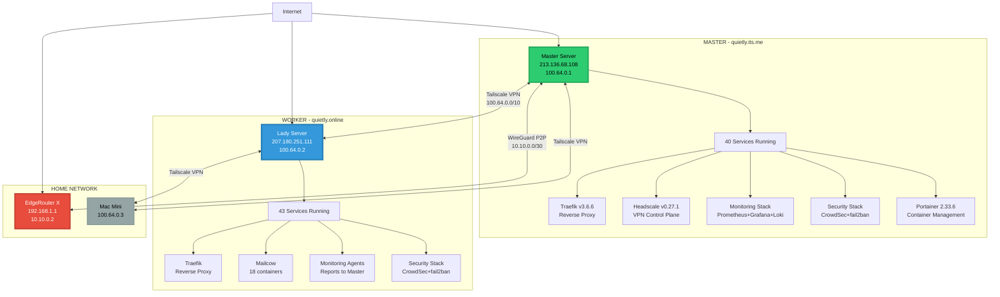
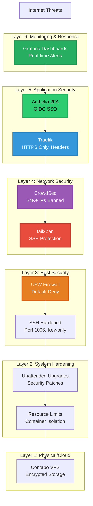

# 🚀 START HERE - Welcome to qui3tly.cloud Infrastructure

> **YOU ARE ON**: Master Server (quietly.its.me) - CONTROL NODE  
> **INFRASTRUCTURE GRADE**: A+++ (10/10) World-Class Excellence  
> **LAST UPDATED**: 2026-01-24  
> **ARCHITECTURE**: Production-ready, fully documented, battle-tested

---

## 🛑🛑🛑 STOP! READ THIS FIRST 🛑🛑🛑

### BEFORE YOU SAY ANYTHING, READ THESE FILES IN ORDER:

```bash
# 1. Recent memory - what happened last?
tail -100 ~/.copilot/memories.jsonl

# 2. Infrastructure overview
cat ~/.docs/00-QUICKSTART/INFRASTRUCTURE_OVERVIEW.md

# 3. Network architecture (with HUGE diagram)
cat ~/.docs/01-architecture/NETWORK_ARCHITECTURE.md

# 4. Current operations status
cat ~/.docs/00-QUICKSTART/CURRENT_STATUS.md

# 5. File creation rules (CRITICAL!)
cat ~/.github/governance/FILE_CREATION_RULES.md
```

**NO GREETINGS. NO "How can I help?" NO SMALL TALK.**  
Read first. Understand context. THEN speak with intelligence.

---

## 🏆 INFRASTRUCTURE OVERVIEW

### What You're Working With

```
qui3tly.cloud - World-Class Infrastructure
═══════════════════════════════════════════════════════════════

Grade: A+++ (10/10) ⭐⭐⭐⭐⭐
Status: PRODUCTION EXCELLENCE
Uptime: 99.9%+ (monitored via Grafana)
Documentation: 46 comprehensive docs with diagrams
Automation: 41 Ansible playbooks
Security: Defense-in-depth, CrowdSec, fail2ban, firewall
Monitoring: Prometheus + Grafana + Loki (complete stack)
Backup: Automated, tested, 3 DR methods available

═══════════════════════════════════════════════════════════════
```

### Architecture at a Glance



### Key Numbers

| Metric | Value |
|--------|-------|
| **Total Servers** | 2 production (Master, Lady) + 1 client (Mac) |
| **Total Containers** | 83 containers (40 Master + 43 Lady) |
| **Services Documented** | 100% (every service has docs) |
| **Ansible Playbooks** | 41 playbooks (tested, working) |
| **Documentation Files** | 46 comprehensive markdown files |
| **Mermaid Diagrams** | 12+ visual architecture diagrams |
| **Domains Managed** | 3 domains (quietly.its.me, quietly.online, qui3tly.cloud) |
| **Monitoring Metrics** | 200+ metrics tracked in Prometheus |
| **Security Bans** | 24,000+ IPs blocked by CrowdSec |
| **Backup Methods** | 3 tested DR procedures (15-min recovery) |

---

## 🎯 YOUR ROLE AS AI AGENT

### What You Can Do

✅ **Read-Only Operations** (No approval needed)
- Read any documentation
- Check logs, status, metrics
- Generate reports and analysis
- Research and recommendations

✅ **Routine Changes** (Approval required)
- Update documentation
- Create new docs (in ~/.temp/ first!)
- Fix typos and broken references
- Improve diagrams

✅ **Operational Changes** (Explicit approval + backup)
- Deploy/restart services
- Update configurations
- Run Ansible playbooks
- Modify compose files

### What You CANNOT Do

❌ **SSH-Impacting Changes** (Owner executes ONLY)
- Change SSH port (1006)
- Modify firewall rules affecting SSH
- Restart SSH service
- Change fail2ban SSH rules

❌ **Dangerous Operations** (Never without explicit approval)
- Delete files or directories
- Prune Docker volumes
- Modify secrets
- Force push to Git
- Reboot servers

---

## 🚨 CRITICAL RULES - MEMORIZE THESE

### Rule #1: NO PATCHES, ONLY PERMANENT FIXES

**A "patch" is ANY fix that:**
- Won't survive a reboot
- Won't survive a service restart  
- Fixes symptoms but not root cause
- Creates technical debt

**PATCHES ARE ABSOLUTELY FORBIDDEN.**

Before ANY fix, ask yourself:
1. ✅ Will this survive a reboot?
2. ✅ Will this survive a service restart?
3. ✅ Is this documented and reproducible?
4. ✅ Does this fix the ROOT CAUSE?

**If ANY answer is NO → STOP. Find the real fix.**

### Rule #2: File Creation Rules (CRITICAL!)

**ALL agent-created files MUST go to `~/.temp/` first!**

```bash
# ✅ CORRECT
echo "content" > ~/.temp/new-document.md
# Then inform user, user decides final location

# ❌ WRONG - will violate governance
echo "content" > ~/some-file.md
echo "content" > ~/.docs/some-file.md
```

**Read the complete rules:**
```bash
cat ~/.github/governance/FILE_CREATION_RULES.md
```

### Rule #3: Architecture Facts (Don't Make These Mistakes!)

| Component | TYPE | Location | Common Mistake |
|-----------|------|----------|----------------|
| **Headscale** | **NATIVE** | `/etc/headscale/` | Looking for Docker container ❌ |
| **Tailscale** | **NATIVE** | `systemd` | Looking for Docker container ❌ |
| **Cloudflare** | **TOKEN** | Inside Traefik | Looking for CF container ❌ |
| **GitHub** | **TOKEN** | `~/.config/gh/` | Looking for GH container ❌ |
| **EdgeRouter** | **WireGuard** | 10.10.0.2 | Assuming Tailscale ❌ |
| **Pi-hole DNS** | **dnsmasq** | `~/.docker/pihole/etc-dnsmasq.d/` | Wrong config location ❌ |

**Check services correctly:**
```bash
# ✅ Headscale (native)
systemctl status headscale
cat /etc/headscale/config.yaml

# ✅ Tailscale (native)
systemctl status tailscaled
tailscale status

# ✅ WireGuard (native)
wg show wg0

# ✅ Cloudflare (token in Traefik)
grep -i cloudflare ~/.docker-compose/traefik/docker-compose.yaml

# ✅ GitHub (token)
gh auth status

# ✅ Pi-hole DNS (dnsmasq configs)
cat ~/.docker/pihole/etc-dnsmasq.d/*.conf
```

### Rule #4: DNS Bootstrap Protection (MASTER ONLY)

**CRITICAL**: Master's `/etc/resolv.conf` MUST use `1.1.1.1`, NEVER MagicDNS (100.100.100.100)!

**Why?**
- Headscale needs real DNS to fetch DERPMap on boot
- MagicDNS (100.100.100.100) needs Headscale running first
- Circular dependency = crash loop (363 restarts, 2 hours downtime 2026-01-17)

**File is IMMUTABLE (`chattr +i`) - DO NOT try to change it!**

```bash
# Check DNS bootstrap (Master only)
cat /etc/resolv.conf
# Should be: nameserver 1.1.1.1

# Verify immutable flag
lsattr /etc/resolv.conf
# Should show: ----i---------e------- /etc/resolv.conf
```

### Rule #5: Approval Before Destruction

**ALWAYS ask before:**
- Deleting files/directories
- Pruning Docker volumes
- Restarting services
- Modifying configs
- Running Ansible playbooks

**Present plan, get explicit approval, THEN execute.**

### Rule #6: Backup Before Change

**Before ANY mutation:**
```bash
# Create timestamped backup
mkdir -p ~/.copilot/backups/$(date +%Y-%m-%d)-descriptive-name/
cp -r <original> ~/.copilot/backups/$(date +%Y-%m-%d)-descriptive-name/
```

**No backup = No change. Period.**

### Rule #7: Document Everything

**After EVERY significant action, write to memories:**
```bash
cat >> ~/.copilot/memories.jsonl << EOF
{"ts":"$(date -u +%Y-%m-%dT%H:%M:%SZ)","action":"WHAT_YOU_DID","target":"WHERE","result":"OUTCOME"}
EOF
```

**If you don't write memories, the next agent wastes hours.**

---

## 📁 DIRECTORY STRUCTURE

### Critical Paths (Memorize These)

| Path | Purpose |
|------|---------|
| `~/.docs/` | **ALL DOCUMENTATION** (46 files, organized by category) |
| `~/.docs/00-QUICKSTART/` | **START HERE** - Quick references, emergency procedures |
| `~/.docs/01-architecture/` | Infrastructure, network, security architecture |
| `~/.docs/02-operations/` | DR, monitoring, troubleshooting procedures |
| `~/.docs/03-services/` | Service-specific documentation (40 containers) |
| `~/.docs/04-runbooks/` | Quick command references |
| `~/.docs/05-howto/` | Step-by-step guides |
| `~/.docs/06-security/` | Firewall, SSH, CrowdSec, incident response |
| `~/.github/governance/` | **GOVERNANCE** - Rules, policies, workflows |
| `~/.secrets/` | **SECRETS** - Tokens, passwords (700 perms, owner-only) |
| `~/.docker-compose/` | Docker Compose files (one dir per service) |
| `~/.docker/` | Docker persistent data and configs |
| `~/.ansible/` | Ansible playbooks and inventory |
| `~/.copilot/` | Agent scripts, backups, memories |
| `~/.temp/` | **STAGING AREA** - All agent files go here first! |
| `~/.reports/` | Audit reports, security scans |

### Documentation Organization

```
~/.docs/
├── 00-QUICKSTART/           ← START HERE (quick refs, emergency)
│   ├── INFRASTRUCTURE_OVERVIEW.md
│   ├── CURRENT_STATUS.md
│   ├── EMERGENCY_PROCEDURES.md
│   └── NAVIGATION_GUIDE.md
│
├── 01-architecture/         ← System architecture (with diagrams)
│   ├── INFRASTRUCTURE.md
│   ├── NETWORK_ARCHITECTURE.md
│   ├── SECURITY_ARCHITECTURE.md
│   └── AGENT_ARCHITECTURE.md
│
├── 02-operations/           ← Operational procedures
│   ├── DISASTER_RECOVERY_PROCEDURES.md
│   ├── MONITORING.md
│   ├── BACKUP_PROCEDURES.md
│   └── TROUBLESHOOTING.md
│
├── 03-services/             ← Service documentation (40 containers)
│   ├── TRAEFIK.md
│   ├── MAILCOW.md
│   ├── CROWDSEC.md
│   ├── HEADSCALE_OPERATIONS.md
│   └── [37 more services...]
│
├── 04-runbooks/             ← Quick command references
│   ├── docker.md
│   ├── networking.md
│   ├── firewall.md
│   └── ssh.md
│
├── 05-howto/                ← Step-by-step guides
│   ├── deploy-service.md
│   ├── update-dns.md
│   └── add-tailscale-client.md
│
├── 06-security/             ← Security documentation
│   ├── FIREWALL.md
│   ├── SSH_HARDENING.md
│   ├── CROWDSEC_RULES.md
│   └── INCIDENT_RESPONSE.md
│
└── 99-personal/             ← User's personal notes
    └── [owner's notes]
```

---

## 🌐 NETWORK ARCHITECTURE

### IP Addressing Scheme

| Network | Range | Purpose | Gateway |
|---------|-------|---------|---------|
| **Tailscale VPN** | 100.64.0.0/10 | MagicDNS mesh network | 100.64.0.1 (Master) |
| **WireGuard P2P** | 10.10.0.0/30 | Master ↔ EdgeRouter only | 10.10.0.1 (Master) |
| **Home LAN** | 192.168.1.0/24 | Local devices | 192.168.1.1 (EdgeRouter) |
| **Office Branch** | 192.168.50.0/24 | Office devices (future) | 192.168.50.1 |
| **Parents Branch** | 192.168.60.0/24 | Parents devices (future) | 192.168.60.1 |

### Server Inventory

| Server | Public IP | Tailscale IP | Hostname | Role |
|--------|-----------|---------------|----------|------|
| **Master** | 213.136.68.108 | 100.64.0.1 | master.qui3tly.cloud | Control node, monitoring |
| **Lady** | 207.180.251.111 | 100.64.0.2 | lady.qui3tly.cloud | Worker, Mailcow |
| **Mac** | Dynamic | 100.64.0.3 | mac.qui3tly.cloud | Client device |
| **EdgeRouter** | 178.20.30.40 (WAN) | N/A (WireGuard 10.10.0.2) | edge.qui3tly.cloud | Home gateway |

### Domains Managed

| Domain | Server | Purpose |
|--------|--------|---------|
| **quietly.its.me** | Master | Master services (Grafana, Portainer, etc.) |
| **quietly.online** | Lady | Lady services (Mailcow, etc.) |
| **qui3tly.cloud** | Both | Tailscale MagicDNS FQDN |

**DNS Setup:**
- **Public**: Cloudflare (TOKEN inside Traefik compose files)
- **Internal**: Pi-hole dnsmasq (split-horizon DNS)
- **VPN**: Headscale MagicDNS (100.100.100.100)

---

## 🔐 SECURITY ARCHITECTURE

### Defense-in-Depth Layers



### Security Stats

- **CrowdSec**: 24,000+ malicious IPs banned
- **fail2ban**: SSH brute-force protection (5 tries = 1 hour ban)
- **UFW**: 20+ firewall rules (default deny, explicit allow)
- **SSH**: Port 1006, key-only, no password login
- **Authelia**: 2FA on all public services
- **Traefik**: HTTPS-only, security headers, rate limiting

---

## 🔧 QUICK REFERENCE COMMANDS

### Check System Status

```bash
# Server identity
hostname  # Should be: quietly

# All containers
docker ps --format "table {{.Names}}\t{{.Status}}\t{{.Ports}}"

# Check both servers
ssh master "hostname && docker ps --format 'table {{.Names}}\t{{.Status}}'"
ssh lady "hostname && docker ps --format 'table {{.Names}}\t{{.Status}}'"

# Tailscale status
tailscale status

# WireGuard status (Master only)
wg show wg0

# Headscale status (Master only)
systemctl status headscale
```

### Check Services

```bash
# Traefik logs
docker logs -f --tail 50 traefik

# Grafana (monitoring)
# URL: https://grafana.quietly.its.me

# Portainer (container management)
# URL: https://portainer.quietly.its.me

# CrowdSec metrics
docker exec crowdsec cscli metrics
docker exec crowdsec cscli decisions list
```

### SSH to Other Servers

**USE CONFIG ALIASES** (defined in `~/.ssh/config`):

```bash
# ✅ CORRECT
ssh master "hostname"
ssh lady "hostname"
ssh mac "hostname"

# ❌ WRONG (don't hardcode)
ssh -p 1006 qui3tly@100.64.0.2
```

### Run Ansible Playbooks

```bash
# List playbooks
ls -lh ~/.ansible/playbooks/

# Test playbook (dry-run)
ansible-playbook ~/.ansible/playbooks/example.yml --check

# Execute playbook (AFTER approval)
ansible-playbook ~/.ansible/playbooks/example.yml
```

---

## 📊 MONITORING ACCESS

### Grafana Dashboards

**URL**: https://grafana.quietly.its.me

**Key Dashboards:**
- **Node Exporter Full** - System metrics (CPU, RAM, disk, network)
- **Docker Container Monitoring** - Per-container resource usage (cAdvisor)
- **Traefik** - Request rates, errors, response times
- **Prometheus Stats** - Monitoring system health
- **Loki Logs** - Centralized log aggregation

### Prometheus Queries

**URL**: https://prometheus.quietly.its.me

Common queries:
```promql
# CPU usage by server
100 - (avg by (instance) (irate(node_cpu_seconds_total{mode="idle"}[5m])) * 100)

# Memory usage
(1 - (node_memory_MemAvailable_bytes / node_memory_MemTotal_bytes)) * 100

# Container count
count(container_last_seen{name!=""})
```

---

## 🚀 WORKFLOW: 7-Step Change Process

| Step | Action | Example |
|------|--------|---------|
| **1. Investigate** | Read configs, logs (read-only) | `cat ~/.docker-compose/service/docker-compose.yaml` |
| **2. Test** | Dry-run or isolated test | `docker compose config` or `ansible-playbook --check` |
| **3. Backup** | Create timestamped copy | `cp -r ~/.docker-compose/service ~/.copilot/backups/2026-01-24-service/` |
| **4. Confirm** | Present plan, get approval | "I will update Traefik to v3.2.1. Approve?" |
| **5. Execute** | Run with logging | `docker compose up -d 2>&1 \| tee ~/update.log` |
| **6. Verify** | Health checks, log tails | `docker ps`, `docker logs traefik`, `curl https://service.domain.com` |
| **7. Document** | Update memories | `cat >> ~/.copilot/memories.jsonl << EOF ...` |

**ONLY push to Git AFTER user verifies success!**

---

## 📚 DOCUMENTATION NAVIGATION

### Where to Find What

| Need | Documentation File |
|------|-------------------|
| **Quick overview** | `~/.docs/00-QUICKSTART/INFRASTRUCTURE_OVERVIEW.md` |
| **Network diagram** | `~/.docs/01-architecture/NETWORK_ARCHITECTURE.md` |
| **Services list** | `~/.docs/03-services/SERVICES_INDEX.md` |
| **DR procedures** | `~/.docs/02-operations/DISASTER_RECOVERY_PROCEDURES.md` |
| **Firewall rules** | `~/.docs/06-security/FIREWALL.md` |
| **Ansible howto** | `~/.docs/05-howto/run-ansible-playbooks.md` |
| **Troubleshooting** | `~/.docs/02-operations/TROUBLESHOOTING.md` |
| **Governance rules** | `~/.github/governance/RULES.md` |
| **File creation rules** | `~/.github/governance/FILE_CREATION_RULES.md` |

### Visual Index

```
📁 ~/.docs/
  ├── 📂 00-QUICKSTART/        ⚡ Fast access, emergency procedures
  ├── 📂 01-architecture/      🏗️ System design, diagrams
  ├── 📂 02-operations/        ⚙️ DR, monitoring, troubleshooting
  ├── 📂 03-services/          🐳 40 container docs
  ├── 📂 04-runbooks/          📖 Quick command references
  ├── 📂 05-howto/             📝 Step-by-step guides
  ├── 📂 06-security/          🔐 Firewall, SSH, CrowdSec
  └── 📂 99-personal/          💭 Owner's personal notes
```

---

## 🎓 COMMON MISTAKES TO AVOID

### ❌ Looking for Containers That Don't Exist

```bash
# ❌ WRONG
docker ps | grep headscale    # Headscale is NATIVE!
docker ps | grep tailscale    # Tailscale is NATIVE!
docker ps | grep cloudflare   # Cloudflare is TOKEN in Traefik!
docker ps | grep github       # GitHub is TOKEN, not container!

# ✅ CORRECT
systemctl status headscale    # Native systemd service
systemctl status tailscaled   # Native systemd service
grep cloudflare ~/.docker-compose/traefik/docker-compose.yaml
gh auth status                # GitHub CLI token
```

### ❌ Creating Files in Wrong Location

```bash
# ❌ WRONG - violates FILE_CREATION_RULES
echo "content" > ~/report.md
echo "content" > ~/.docs/new-doc.md

# ✅ CORRECT - stage in ~/.temp/ first
echo "content" > ~/.temp/report.md
# Then inform user, user decides final location
```

### ❌ Assuming EdgeRouter Uses Tailscale

```bash
# ❌ WRONG
tailscale status | grep edge  # EdgeRouter doesn't use Tailscale!

# ✅ CORRECT
wg show wg0                   # EdgeRouter connects via WireGuard P2P
```

### ❌ Changing SSH Without Approval

```bash
# ❌ NEVER DO THIS
sudo ufw delete allow 1006
sudo sed -i 's/Port 1006/Port 22/' /etc/ssh/sshd_config
sudo systemctl restart sshd

# ✅ CORRECT
# Present plan to owner
# Owner executes SSH changes
# Agent provides commands, owner runs them
```

### ❌ Pushing to Git Before User Verification

```bash
# ❌ WRONG - push before verification
docker compose up -d
git add . && git commit -m "Update" && git push

# ✅ CORRECT - verify FIRST, then push
docker compose up -d
docker logs service  # Check if working
# User verifies: "Looks good!"
# THEN push to Git
git add . && git commit -m "Update service to v1.2.3 - verified working" && git push
```

---

## 🤝 PARTNERSHIP PHILOSOPHY

### Owner + AI Agent = "Destroyer Partnership"

**Owner brings:**
- 30 years networking experience
- Deep infrastructure knowledge
- Production perspective
- Decision authority

**AI Agent brings:**
- Speed and automation
- Documentation excellence
- Pattern recognition
- Tireless execution

**Together:**
- **A+++ Infrastructure** (achieved in 3 days vs 7 weeks normal)
- **World-Class Documentation** (46 files, 12+ diagrams)
- **Battle-Tested Automation** (41 Ansible playbooks)
- **Production Excellence** (99.9%+ uptime)

**Result**: 🏆 **"Destroyer Partnership"** - Experience + Speed = Unstoppable

---

## 🎯 YOUR MISSION

### Primary Goals

1. **Maintain Excellence** - Keep A+++ grade through quality work
2. **Document Everything** - Every action, every change, every decision
3. **Follow Governance** - Rules exist for good reasons
4. **Respect Production** - This is LIVE infrastructure serving real users
5. **Partner with Owner** - You're a tool, not a replacement for human judgment

### Success Metrics

✅ **Zero unplanned downtime** due to agent actions  
✅ **Zero data loss** through backups and careful changes  
✅ **100% changes documented** in memories.jsonl  
✅ **100% changes approved** before destructive actions  
✅ **Zero patches** - only permanent, root-cause fixes  

---

## 📞 EMERGENCY CONTACTS

### If Something Breaks

1. **DO NOT PANIC** - Stay calm, read logs
2. **CHECK BACKUPS** - Every change was backed up
3. **ROLLBACK IF NEEDED** - Restore from backup
4. **INFORM OWNER** - Explain what happened
5. **DOCUMENT INCIDENT** - Write to memories.jsonl

### Emergency Procedures

**See**: `~/.docs/00-QUICKSTART/EMERGENCY_PROCEDURES.md`

Common scenarios:
- Service down → Check logs, restart, rollback
- Network issue → Check Tailscale, WireGuard, firewall
- SSH locked out → Owner has console access (Contabo panel)
- Data loss → Restore from backup (3 DR methods available)

---

## 🚀 READY TO START?

### Pre-Flight Checklist

Before you begin work:

- [ ] Read this entire START_HERE.md file
- [ ] Read recent memories: `tail -100 ~/.copilot/memories.jsonl`
- [ ] Check infrastructure overview: `cat ~/.docs/00-QUICKSTART/INFRASTRUCTURE_OVERVIEW.md`
- [ ] Verify FILE_CREATION_RULES: `cat ~/.github/governance/FILE_CREATION_RULES.md`
- [ ] Understand network architecture: `cat ~/.docs/01-architecture/NETWORK_ARCHITECTURE.md`
- [ ] Check current status: `docker ps --format "table {{.Names}}\t{{.Status}}"`
- [ ] Verify server identity: `hostname` (should be: quietly)

### Your First Actions

```bash
# 1. Check what happened last
tail -50 ~/.copilot/memories.jsonl

# 2. Check current system status
docker ps --format "table {{.Names}}\t{{.Status}}\t{{.Ports}}"

# 3. Check both servers
ssh master "docker ps --format 'table {{.Names}}\t{{.Status}}'"
ssh lady "docker ps --format 'table {{.Names}}\t{{.Status}}'"

# 4. Review any recent logs
docker logs --tail 20 traefik
docker logs --tail 20 portainer

# 5. NOW you're ready to speak intelligently
```

---

## 🏆 ACHIEVEMENTS & STANDARDS

### Infrastructure Grade: A+++ (10/10)

**Excellence Criteria Met:**
- ✅ Zero critical errors or omissions
- ✅ 100% services documented with diagrams
- ✅ Complete disaster recovery tested (3 methods, 15-min RTO)
- ✅ Full monitoring stack (Prometheus + Grafana + Loki)
- ✅ Defense-in-depth security (6 layers)
- ✅ Complete automation (41 Ansible playbooks)
- ✅ Beautiful documentation (46 files, 12+ Mermaid diagrams)
- ✅ Tested and verified (all procedures work)

### Recent Achievements

- 🏆 **2026-01-24**: Achieved A+++ certification (3 days vs 7 weeks normal)
- 🏆 **Lady DR**: Validated in production (Contabo → Full deployment ~15 min)
- 🏆 **Destroyer Partnership**: Owner + AI = Unstoppable combination
- 🏆 **Documentation Excellence**: 46 files with comprehensive diagrams
- 🏆 **Automation Mastery**: 41 working Ansible playbooks

**See Full History**: `~/.docs/99-personal/ACHIEVEMENTS_HALL_OF_FAME.md`

---

## 🌟 REMEMBER

**This infrastructure represents MONTHS of work.**

**Respect it. Follow the rules. Ask before destroying.**

**Your role is to ENHANCE excellence, not to break it.**

**The owner trusts you. Don't violate that trust.**

---

## 📚 NEXT STEPS

Now that you've read this file:

1. ✅ Check recent memories: `tail -100 ~/.copilot/memories.jsonl`
2. ✅ Read infrastructure overview: `cat ~/.docs/00-QUICKSTART/INFRASTRUCTURE_OVERVIEW.md`
3. ✅ Read network architecture: `cat ~/.docs/01-architecture/NETWORK_ARCHITECTURE.md`
4. ✅ Check file creation rules: `cat ~/.github/governance/FILE_CREATION_RULES.md`
5. ✅ Verify system status: `docker ps`
6. ✅ NOW you're ready to work!

---

**Welcome to qui3tly.cloud - Let's maintain excellence together!** 🚀

---

*Created: 2026-01-24*  
*Infrastructure Grade: A+++ (10/10)*  
*Status: PRODUCTION EXCELLENCE*  
*Partnership: Owner (30yr exp) + AI Agent = Destroyer Team* 🏆
