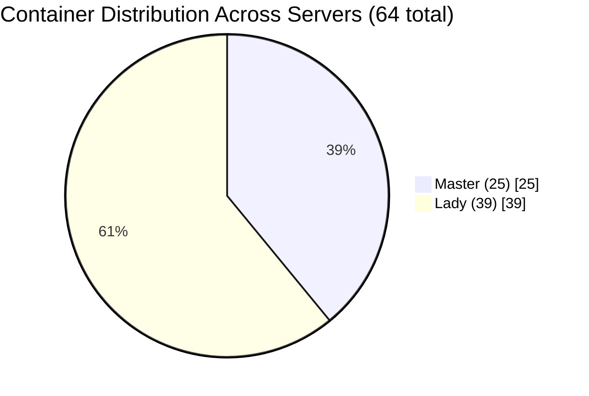
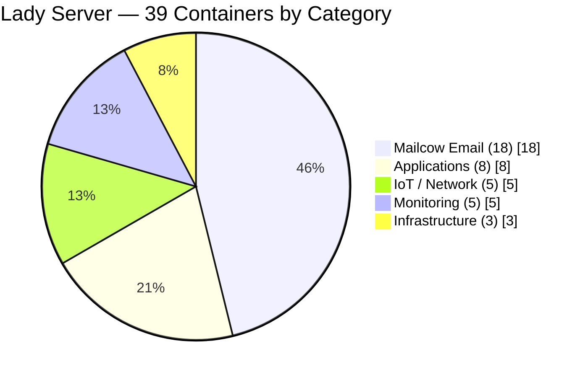
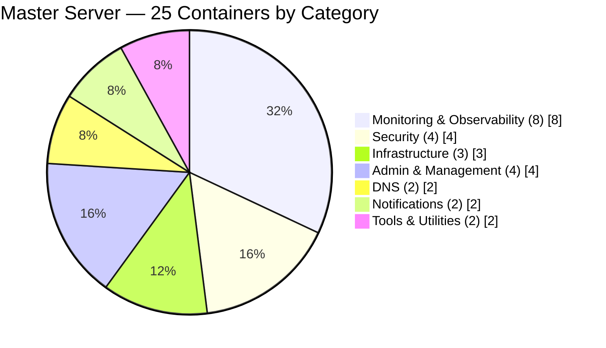
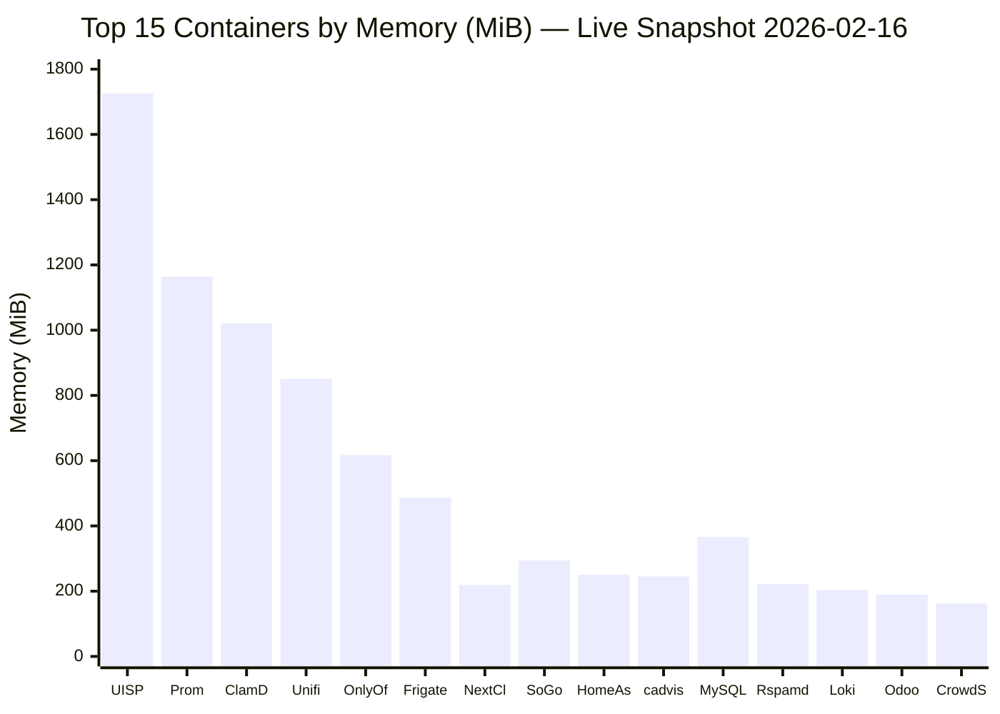
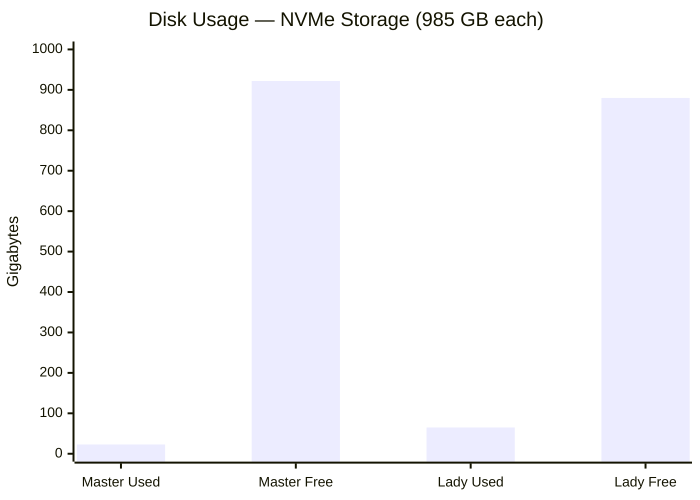
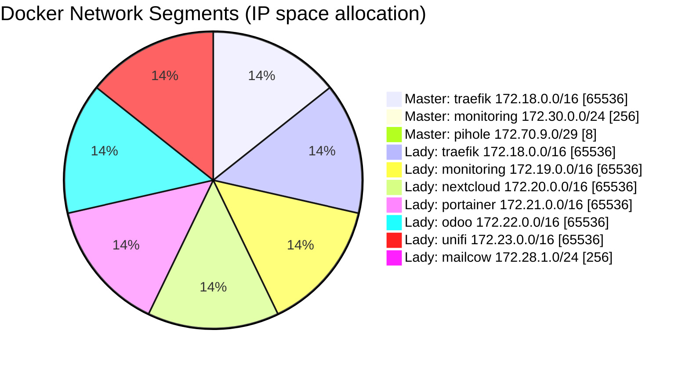
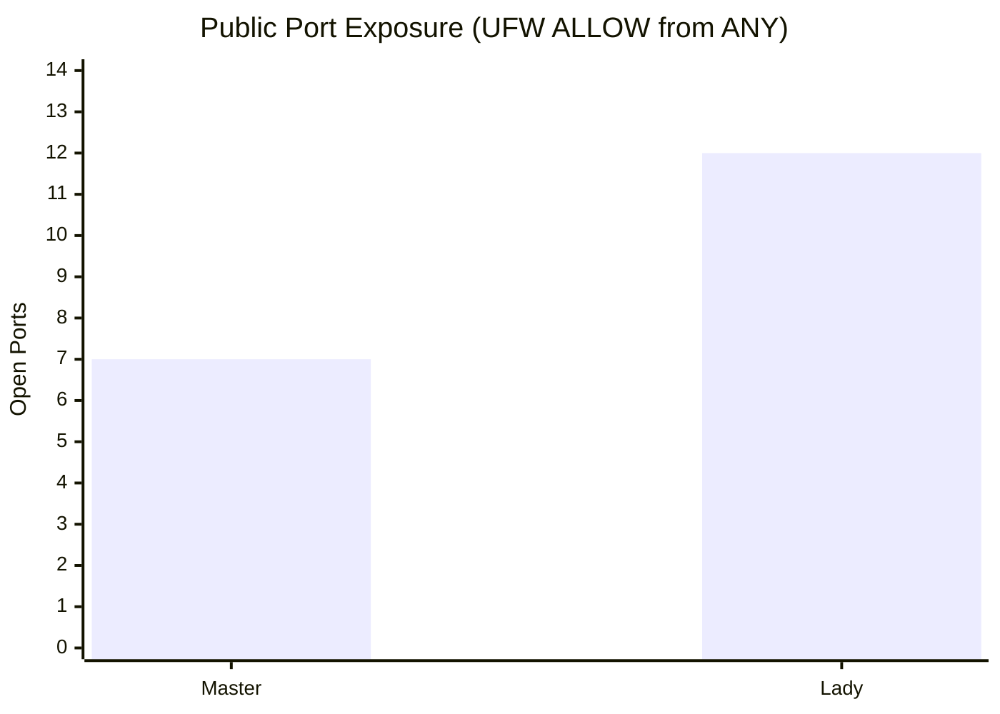
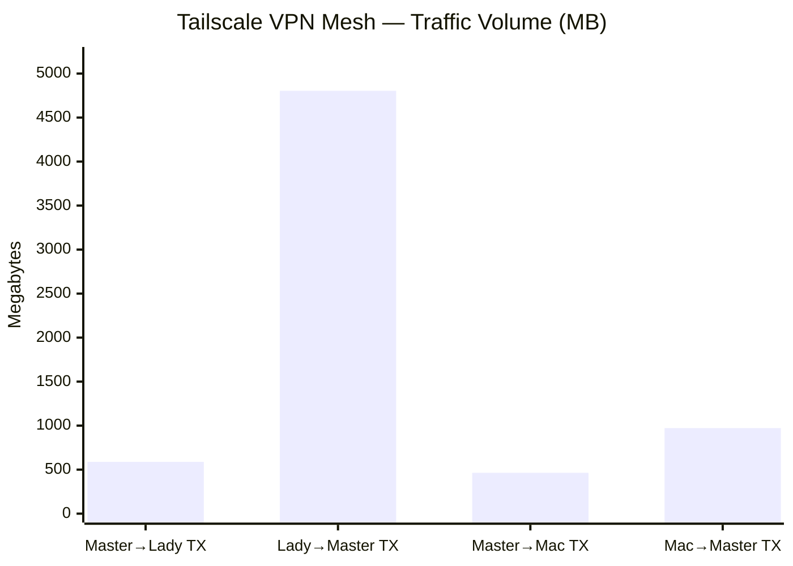

# Infrastructure Data Visualization — Charts & Metrics

> **Author**: qui3tly (One of the first CCIE in the region)  
> **Verified**: 2026-02-16 (ALL data from `docker stats --no-stream` on LIVE system)  
> **Standard**: Cisco CCIE-level documentation  
> **Scope**: Resource distribution, container metrics, network allocation

---

## 1. CONTAINER DISTRIBUTION — Pie Chart (by Server)



---

## 2. LADY CONTAINERS — Pie Chart (by Function)



---

## 3. MASTER CONTAINERS — Pie Chart (by Function)



---

## 4. MEMORY USAGE — Top 15 Containers (Bar Chart)



### Memory Usage — Full Data Table

```
═══════════════════════════════════════════════════════════════════════════════════════
                CONTAINER MEMORY USAGE — ALL 64 CONTAINERS
                Source: docker stats --no-stream (2026-02-16)
═══════════════════════════════════════════════════════════════════════════════════════

MASTER SERVER (25 containers — Total RAM: 47 GiB, Used: 5.7 GiB)
─────────────────────────────────────────────────────────────────────────────────────
Container            Memory Used    Limit       CPU %    Net I/O (TX/RX)
━━━━━━━━━━━━━━━━━━━━━━━━━━━━━━━━━━━━━━━━━━━━━━━━━━━━━━━━━━━━━━━━━━━━━━━━━━━━━━━━━
prometheus           1,137 MiB      2 GiB       0.00%    420M / 7.8M
cadvisor               245 MiB      47 GiB      6.65%    105M / 8.5G
loki                   204 MiB      47 GiB      1.29%    421M / 432M
uptime-kuma            170 MiB      47 GiB      1.24%    37.8K / 4.1K
crowdsec               162 MiB      47 GiB      0.03%    17.3M / 54.6M
promtail               145 MiB      47 GiB      2.84%    11.5M / 66.8M
grafana                107 MiB      1 GiB       0.25%    10.6M / 70.4M
portainer               93 MiB      47 GiB      0.00%    886M / 69.5M
authelia                 85 MiB      47 GiB      0.06%    2.5M / 6.8M
pihole                   64 MiB      47 GiB      0.28%    28.1M / 23.1M
semaphore                63 MiB      47 GiB      0.00%    79.1K / 3.5M
ntfy                     55 MiB      47 GiB      0.00%    5.2M / 4.2M
traefik                  54 MiB      47 GiB      0.00%    278M / 437M
alertmanager             53 MiB      256 MiB     0.20%    26.2M / 106M
gotify                   44 MiB      47 GiB      0.00%    82.4K / 388K
admin-panel              37 MiB      47 GiB     16.49%    1.3G / 1.2G
bouncer-traefik          30 MiB      47 GiB      0.00%    15.5M / 8.6M
blackbox                 29 MiB      47 GiB      0.00%    134M / 70.6M
node-exporter            28 MiB      47 GiB      0.00%    13.8M / 289M
cloudflared              24 MiB      47 GiB      0.03%    26.6M / 30.8M
headscale-ui             19 MiB      47 GiB      0.00%    20.4K / 221K
headscale-admin          16 MiB      47 GiB      0.00%    2.1K / 126B
it-tools                 14 MiB      47 GiB      0.00%    8.6K / 126B
fuckoff-page             10 MiB      47 GiB      0.00%    3.1K / 126B
default-landing           9 MiB      47 GiB      0.00%    2.5K / 126B
─────────────────────────────────────────────────────────────────────────────────────
TOTAL MASTER:        ~2,887 MiB (2.82 GiB of 47 GiB = 6.0%)


LADY SERVER (39 containers — Total RAM: 47 GiB, Used: 9.6 GiB)
─────────────────────────────────────────────────────────────────────────────────────
Container            Memory Used    Limit       CPU %    Net I/O (TX/RX)
━━━━━━━━━━━━━━━━━━━━━━━━━━━━━━━━━━━━━━━━━━━━━━━━━━━━━━━━━━━━━━━━━━━━━━━━━━━━━━━━━
uisp                 1,684 MiB      47 GiB      2.42%    513K / 209K
clamd-mailcow        1,021 MiB      47 GiB      3.03%    3.0M / 2.7M
unifi                  851 MiB      47 GiB      0.51%    38.3M / 23M
onlyoffice             617 MiB      47 GiB      0.36%    63.9M / 530K
frigate                487 MiB      47 GiB      0.99%    4.1M / 64.6M
mysql-mailcow          366 MiB      47 GiB      0.78%    34.6M / 733M
cadvisor               339 MiB      47 GiB    155.52%    121M / 9.6G
sogo-mailcow           294 MiB      47 GiB      0.06%    15.1M / 46.9M
unifi-db               255 MiB      47 GiB      1.61%    21.8M / 33.6M
homeassistant          250 MiB      47 GiB      0.04%    319K / 6.7M
rspamd-mailcow         222 MiB      47 GiB      0.57%    223M / 25.9M
nextcloud              219 MiB      47 GiB      0.01%    22.3G / 3.0G
ofelia-mailcow         201 MiB      47 GiB      0.00%    76.1K / 126B
odoo                   189 MiB      1 GiB       0.04%    32.5M / 28.6M
php-fpm-mailcow        143 MiB      47 GiB      0.01%    46.7M / 96.2M
crowdsec               133 MiB      47 GiB      0.56%    11.6M / 3.7M
nextcloud-db           131 MiB      47 GiB      0.03%    1.3G / 3.6G
promtail                91 MiB      47 GiB      3.20%    43.1M / 341M
postfix-mailcow         78 MiB      47 GiB      0.02%    35.4M / 93.8M
dovecot-mailcow         75 MiB      47 GiB      0.07%    72.6M / 164M
traefik                 61 MiB      47 GiB      0.12%    13.1G / 13.1G
dockerapi-mailcow       56 MiB      47 GiB      0.54%    29.9M / 18.5M
unbound-mailcow         44 MiB      47 GiB      0.07%    88.4M / 49.5M
postfix-tlspol          43 MiB      47 GiB      0.02%    3.7M / 2.3M
watchdog-mailcow        35 MiB      47 GiB      4.11%    308M / 269M
netfilter-mailcow       29 MiB      47 GiB      0.47%    0B / 0B
bouncer-traefik         24 MiB      47 GiB      0.00%    4.5M / 48.7K
odoo-db                 24 MiB      512 MiB     0.01%    846K / 829K
nginx-mailcow           19 MiB      47 GiB      0.00%    87.5M / 79.9M
redis-mailcow           18 MiB      47 GiB      0.91%    412M / 405M
portainer-agent         17 MiB      47 GiB      0.00%    65.8M / 884M
node-exporter           17 MiB      47 GiB      0.00%    15.1M / 317M
mysqld-exporter         16 MiB      47 GiB      3.47%    748M / 358M
olefy-mailcow           15 MiB      47 GiB      0.00%    4.0M / 2.7M
nextcloud-redis         11 MiB      47 GiB      0.81%    1.4G / 6.5G
mta-sts                 11 MiB      47 GiB      0.00%    6.9M / 127K
fuckoff-page            10 MiB      47 GiB      0.00%    6.5M / 5.4M
memcached-mailcow        3 MiB      47 GiB      0.03%    2.6M / 1.8M
acme-mailcow             3 MiB      47 GiB      0.01%    212K / 81.3K
─────────────────────────────────────────────────────────────────────────────────────
TOTAL LADY:          ~7,652 MiB (7.47 GiB of 47 GiB = 15.9%)

═══════════════════════════════════════════════════════════════════════════════════════
```

---

## 5. DISK USAGE — Server Comparison (Bar Chart)



---

## 6. NETWORK SEGMENT ALLOCATION — Pie Chart



---

## 7. PORT EXPOSURE — Public Attack Surface (Bar Chart)



### Port Exposure Detail

```
═══════════════════════════════════════════════════════════════════════════════════════
                    PUBLIC ATTACK SURFACE — PORT ANALYSIS
═══════════════════════════════════════════════════════════════════════════════════════

MASTER (7 open ports):                    LADY (12 open port ranges):
┌──────────────────────────────────┐      ┌──────────────────────────────────┐
│  Port      Proto  Service       │      │  Port        Proto  Service     │
│  ━━━━━━━━━━━━━━━━━━━━━━━━━━━━━━ │      │  ━━━━━━━━━━━━━━━━━━━━━━━━━━━━━ │
│  1006      TCP    SSH           │      │  1006        TCP    SSH         │
│    80      TCP    HTTP→Traefik  │      │  60000-61000 UDP    Mosh        │
│   443      TCP    HTTPS→Traefik │      │    80        TCP    HTTP        │
│  8443      TCP    Headscale API │      │   443        TCP    HTTPS       │
│ 51820      UDP    WireGuard     │      │ 41641        UDP    Tailscale   │
│  3478      UDP    DERP relay    │      │    25        TCP    SMTP        │
│ 41641      UDP    Tailscale     │      │   465        TCP    SMTPS       │
│                                  │      │   587        TCP    Submission  │
│  VPN-only (100.64.0.0/10):      │      │   993        TCP    IMAPS       │
│  ALL ports on tailscale0        │      │   995        TCP    POP3S       │
│                                  │      │  4190        TCP    ManageSieve │
│  WG-only (10.10.0.0/30):        │      │                                │
│  ALL ports on wg0               │      │  VPN-only (100.64.0.0/10):     │
│                                  │      │  ALL ports on tailscale0       │
└──────────────────────────────────┘      └──────────────────────────────────┘

Risk Assessment:
━━━━━━━━━━━━━━━━━━━━━━━━━━━━━━━━━━━━━━━━━━━━━━━━━━━━━━━━━━━━━━━━━━━━━━━━━━
Master: LOW  — 7 ports, SSH non-standard, behind Traefik+Authelia+CrowdSec
Lady:   MED  — 12 ports, email ports exposed (required), SSH non-standard
Both:   Protected by Fail2ban + CrowdSec + UFW DROP default policy

═══════════════════════════════════════════════════════════════════════════════════════
```

---

## 8. TAILSCALE MESH — Traffic Volume (Bar Chart)



---

## 9. CPU ALLOCATION — Infrastructure Overview

```
═══════════════════════════════════════════════════════════════════════════════════════
                    HARDWARE RESOURCES — DUAL SERVER COMPARISON
                    Source: nproc, free -h, df -h (2026-02-16)
═══════════════════════════════════════════════════════════════════════════════════════

                    MASTER                              LADY
                    quietly.its.me                      quietly.online
                    213.136.68.108                      207.180.251.111
                    ━━━━━━━━━━━━━━                      ━━━━━━━━━━━━━━

CPU:                12 vCPU                             12 vCPU
                    ████████████░░░░░░░░ ~30%           ████████████████░░░░ ~45%

RAM:                47 GiB total                        47 GiB total
                    5.7 GiB used (12%)                  9.6 GiB used (20%)
                    ██░░░░░░░░░░░░░░░░░░                ████░░░░░░░░░░░░░░░░
                    33 GiB free                         33 GiB free
                    8.1 GiB buff/cache                  4.4 GiB buff/cache
                    Swap: 2 GiB (0% used)               Swap: 2 GiB (0% used)

Disk:               985 GB NVMe                         985 GB NVMe
                    23 GB used (3%)                     65 GB used (7%)
                    █░░░░░░░░░░░░░░░░░░░                ██░░░░░░░░░░░░░░░░░░
                    922 GB available                    880 GB available

Containers:         25 running                          39 running
                    ████████████░░░░░░░░                ████████████████████

Docker RAM:         ~2.8 GiB                            ~7.5 GiB
                    (6.0% of total)                     (15.9% of total)

Network I/O:        Moderate (control plane)            Heavy (mail + apps)
                    Traefik: 278M/437M TX/RX           Traefik: 13.1G/13.1G TX/RX
                    Prometheus: 420M/7.8M              Nextcloud: 22.3G/3.0G

═══════════════════════════════════════════════════════════════════════════════════════
```
