# Network Architecture - Complete Technical Topology

> **Domain**: qui3tly.cloud (Internal FQDN)  
> **Infrastructure**: Multi-server mesh with control center architecture  
> **Last Updated**: 2026-01-24

---

## Network Topology Overview

```mermaid
graph TB
    subgraph Internet["🌐 INTERNET"]
        CF[Cloudflare<br/>DNS + CDN<br/>1.1.1.1, 1.0.0.1]
    end

    subgraph Master["🏢 MASTER.QUI3TLY.CLOUD<br/>Control & Monitoring Center<br/>Contabo VPS"]
        M_PUB["Public: 213.136.68.108<br/>eth0"]
        M_TS["Tailscale: 100.64.0.1<br/>tailscale0"]
        M_WG["WireGuard: 10.10.0.1/30<br/>wg0"]
        M_DOCK["Docker: 172.18.0.0/16<br/>docker0 + networks"]
        
        M_Services["<b>Services (21 containers)</b><br/>────────────────────<br/>Headscale v0.27.1 (native)<br/>Traefik v3.6.6<br/>Portainer 2.33.6<br/>Prometheus v2.49.1<br/>Grafana v10.3.1<br/>Loki v2.9.3<br/>Alertmanager<br/>CrowdSec<br/>Pi-hole<br/>Authelia<br/>IT-Tools<br/>Gotify<br/>Semaphore"]
    end

    subgraph Lady["👩 LADY.QUI3TLY.CLOUD<br/>Worker Node<br/>Contabo VPS"]
        L_PUB["Public: 207.180.251.111<br/>eth0"]
        L_TS["Tailscale: 100.64.0.2<br/>tailscale0"]
        L_DOCK["Docker: 172.19.0.0/16<br/>docker0 + networks"]
        
        L_Services["<b>Services (19 containers)</b><br/>────────────────────<br/>Mailcow (18 containers)<br/>Traefik v3.6.6<br/>Portainer Agent<br/>Promtail v3.0.0<br/>CrowdSec<br/>MTA-STS nginx<br/><br/><b>📋 Coming Soon:</b><br/>Nextcloud<br/>UniFi Controller<br/>UNMS<br/>Home Assistant<br/>VPN Server (GUI)"]
    end

    subgraph Future1["👩 MADAM.QUI3TLY.CLOUD<br/>Worker Node<br/>(Coming Soon)"]
        MA_PUB["Public: TBD<br/>eth0"]
        MA_TS["Tailscale: 100.64.0.3+<br/>tailscale0"]
        MA_Services["<b>Planned Services</b><br/>────────────────────<br/>Portainer Agent<br/>Promtail<br/>CrowdSec<br/>WordPress<br/>Additional apps"]
    end

    subgraph Future2["👩 BEAUTY.QUI3TLY.CLOUD<br/>Worker Node<br/>(Coming Soon)"]
        B_PUB["Public: TBD<br/>eth0"]
        B_TS["Tailscale: 100.64.0.4+<br/>tailscale0"]
        B_Services["<b>Planned Services</b><br/>────────────────────<br/>Portainer Agent<br/>Promtail<br/>CrowdSec<br/>Additional apps"]
    end

    subgraph HomeOffice["🏠 HOME OFFICE<br/>192.168.99.0/24"]
        ER["EdgeRouter X<br/>────────────────────<br/>WAN: 62.4.55.119<br/>LAN: 192.168.99.1/24<br/>WireGuard: 10.10.0.2/30<br/>wg0"]
        Mac["Mac Mini<br/>────────────────────<br/>LAN: 192.168.99.123<br/>Tailscale: 100.64.0.3"]
        Devices["Other Devices<br/>────────────────────<br/>192.168.99.0/24"]
    end

    %% Internet Connections
    CF -.DNS.-> M_PUB
    CF -.DNS.-> L_PUB
    
    %% Master Public
    Internet --> M_PUB
    M_PUB --> M_Services
    
    %% Lady Public
    Internet --> L_PUB
    L_PUB --> L_Services
    
    %% Tailscale Mesh (encrypted overlay)
    M_TS <==Tailscale Mesh<br/>100.64.0.0/10==> L_TS
    M_TS <-.Future.-> MA_TS
    M_TS <-.Future.-> B_TS
    M_TS <==Tailscale Mesh==> Mac
    
    %% WireGuard P2P Tunnel
    M_WG <==WireGuard P2P<br/>10.10.0.0/30<br/>Encrypted==> ER
    
    %% Home Office LAN
    ER --- Mac
    ER --- Devices
    
    %% Monitoring (Master -> Workers)
    M_Services -.Prometheus<br/>Scrape.-> L_Services
    M_Services -.Loki<br/>Logs.-> L_Services
    L_Services -.Promtail<br/>Push.-> M_Services
    
    %% Control (Master -> Workers)
    M_Services -.Portainer<br/>Management.-> L_Services
    M_Services -.Ansible<br/>Deploy.-> L_Services

    classDef masterStyle fill:#4A90E2,stroke:#2E5C8A,stroke-width:3px,color:#fff
    classDef workerStyle fill:#E85285,stroke:#A93661,stroke-width:2px,color:#fff
    classDef futureStyle fill:#95A5A6,stroke:#7F8C8D,stroke-width:2px,color:#fff,stroke-dasharray: 5 5
    classDef homeStyle fill:#F39C12,stroke:#D68910,stroke-width:2px,color:#fff
    classDef internetStyle fill:#3498DB,stroke:#2980B9,stroke-width:2px,color:#fff

    class Master masterStyle
    class Lady workerStyle
    class Future1,Future2 futureStyle
    class HomeOffice homeStyle
    class Internet internetStyle
```



---

## IP Address Allocation Table

### Production Servers (Contabo VPS)

| Hostname | FQDN | Role | Public IP | Tailscale IP | WireGuard IP | Status |
|----------|------|------|-----------|--------------|--------------|--------|
| **master** | master.qui3tly.cloud | Control Center | 213.136.68.108 | 100.64.0.1 | 10.10.0.1/30 | ✅ Active |
| **lady** | lady.qui3tly.cloud | Worker | 207.180.251.111 | 100.64.0.2 | - | ✅ Active |
| **madam** | madam.qui3tly.cloud | Worker | TBD | 100.64.0.3+ | - | 📋 Planned |
| **beauty** | beauty.qui3tly.cloud | Worker | TBD | 100.64.0.4+ | - | 📋 Planned |

### Home Office Network

| Device | FQDN | Role | LAN IP | Tailscale IP | WireGuard IP | Status |
|--------|------|------|--------|--------------|--------------|--------|
| **EdgeRouter** | er.qui3tly.cloud | Gateway | 192.168.99.1/24 | - | 10.10.0.2/30 | ✅ Active |
| **Mac Mini** | mac.qui3tly.cloud | Workstation | 192.168.99.123 | 100.64.0.3 | - | ✅ Active |

### Network Ranges

| Network | CIDR | Purpose | Notes |
|---------|------|---------|-------|
| **Tailscale Mesh** | 100.64.0.0/10 | Overlay VPN | MagicDNS enabled, all nodes |
| **WireGuard P2P** | 10.10.0.0/30 | Master↔EdgeRouter | Static tunnel, 2 IPs only |
| **Home LAN** | 192.168.99.0/24 | Home Office | Behind EdgeRouter |
| **Master Docker** | 172.18.0.0/16 | Container networks | Multiple bridge networks |
| **Lady Docker** | 172.19.0.0/16 | Container networks | Multiple bridge networks |

---

## DNS Architecture - 3-Layer System

```mermaid
graph TD
    subgraph Layer1["🌐 LAYER 1: Cloudflare (Public DNS)"]
        CF_NS["Cloudflare Nameservers<br/>1.1.1.1, 1.0.0.1<br/>────────────────────<br/>A records (public IPs)<br/>MX records (mail)<br/>TXT records (SPF, DKIM, DMARC)"]
    end

    subgraph Layer2["🏢 LAYER 2: Pi-hole (Internal DNS)"]
        PH["Pi-hole + dnsmasq<br/>Container on Master<br/>172.18.0.x<br/>────────────────────<br/>Custom DNS entries<br/>Ad blocking<br/>Conditional forwarding"]
        
        PH_Conf["dnsmasq configs:<br/>────────────────────<br/>quietly.its.me → 100.64.0.1<br/>quietly.online → 100.64.0.2<br/>qui3tly.cloud → MagicDNS"]
    end

    subgraph Layer3["🔗 LAYER 3: MagicDNS (Mesh DNS)"]
        MD["Headscale MagicDNS<br/>100.100.100.100<br/>────────────────────<br/>master.qui3tly.cloud → 100.64.0.1<br/>lady.qui3tly.cloud → 100.64.0.2<br/>mac.qui3tly.cloud → 100.64.0.3<br/>*.qui3tly.cloud → Tailnet IPs"]
    end

    External["External Client<br/>(Internet)"]
    Tailscale["Tailscale Client<br/>(Mesh member)"]
    HomeLAN["Home LAN Client<br/>(192.168.99.x)"]

    External -->|DNS Query| CF_NS
    CF_NS -->|Public IP| External
    
    Tailscale -->|DNS Query| MD
    MD -->|Tailnet IP| Tailscale
    
    HomeLAN -->|DNS via EdgeRouter| PH
    PH -->|Custom entries| HomeLAN
    PH -->|Forward unknown| CF_NS

    classDef cloudStyle fill:#FF9800,stroke:#F57C00,stroke-width:2px,color:#fff
    classDef internalStyle fill:#4CAF50,stroke:#388E3C,stroke-width:2px,color:#fff
    classDef meshStyle fill:#9C27B0,stroke:#7B1FA2,stroke-width:2px,color:#fff

    class Layer1 cloudStyle
    class Layer2 internalStyle
    class Layer3 meshStyle
```



### DNS Resolution Flows

**1. External Client (Internet) → Cloudflare**
```
Client queries mail.quietly.online
  → Cloudflare DNS (1.1.1.1)
  → Returns: 207.180.251.111 (Lady public IP)
  → Client connects to Lady:443 (Traefik)
```

**2. Tailscale Client → MagicDNS**
```
Client queries lady.qui3tly.cloud
  → MagicDNS (100.100.100.100 via Headscale)
  → Returns: 100.64.0.2 (Lady Tailnet IP)
  → Client connects via encrypted Tailscale mesh
```

**3. Home LAN Client → Pi-hole → Cloudflare**
```
Mac queries master.qui3tly.cloud
  → EdgeRouter (192.168.99.1)
  → WireGuard tunnel to Master (10.10.0.1)
  → Pi-hole dnsmasq (custom entry)
  → Returns: 100.64.0.1 (Master Tailnet IP)
  → Mac connects via Tailscale mesh
```

---

## Roles & Responsibilities

### Master (Control Center) 🏢

**Primary Functions:**
- **Headscale Coordination**: Tailscale mesh controller (native systemd service)
- **Monitoring Hub**: Prometheus, Grafana, Loki, Alertmanager
- **Management Console**: Portainer (manages all workers)
- **DNS Server**: Pi-hole with custom dnsmasq configs
- **Security**: CrowdSec decision engine, Authelia SSO
- **VPN Gateway**: WireGuard P2P to home office
- **Automation**: Ansible control node, Semaphore CI/CD

**Services (21 containers + 1 native)**:
- Headscale v0.27.1 (native systemd)
- Traefik v3.6.6 (reverse proxy)
- Portainer 2.33.6 (management UI)
- Prometheus v2.49.1 (metrics)
- Grafana v10.3.1 (visualization)
- Loki v2.9.3 (logs aggregation)
- Alertmanager (alerts)
- Promtail v3.0.0 (log shipper)
- CrowdSec (IDS/IPS)
- Pi-hole (DNS + ad blocking)
- Authelia (SSO + 2FA)
- IT-Tools (utilities)
- Gotify (notifications)
- Semaphore (Ansible UI)
- Headscale-UI (web interface)
- Admin Panel (custom dashboard)
- Fuckoff Page (default fallback)

**Network Interfaces:**
- `eth0`: Public internet (213.136.68.108)
- `tailscale0`: Mesh VPN (100.64.0.1)
- `wg0`: P2P to home (10.10.0.1/30)
- `docker0`: Container bridge (172.18.0.1)
- Multiple Docker networks for service isolation

---

### Lady (Worker Node) 👩

**Primary Functions:**
- **Mail Server**: Mailcow full stack (18 containers)
- **Web Services**: Nextcloud, UniFi, UNMS, Home Assistant (planned)
- **VPN Access**: Simple VPN server with GUI (planned)
- **Worker Services**: Portainer agent, monitoring agents, CrowdSec

**Current Services (19 containers)**:
- Mailcow stack (18 containers):
  - Postfix (SMTP)
  - Dovecot (IMAP/POP3)
  - Nginx (webmail proxy)
  - SOGo (webmail)
  - Rspamd (spam filter)
  - ClamAV (antivirus)
  - MariaDB (database)
  - Redis (cache)
  - Solr (search)
  - PHP-FPM (backend)
  - ACME (certificates)
  - Watchdog (monitoring)
  - And 6 more...
- Traefik v3.6.6 (reverse proxy)
- Portainer Agent (managed by Master)
- Promtail v3.0.0 (logs to Master)
- CrowdSec (local bouncer)
- MTA-STS nginx (mail security)

**Planned Services:**
- Nextcloud (file sync & collaboration)
- UniFi Controller (network management)
- UNMS (ISP management)
- Home Assistant (home automation)
- VPN Server with GUI (remote access)
- WordPress (website migration)

**Network Interfaces:**
- `eth0`: Public internet (207.180.251.111)
- `tailscale0`: Mesh VPN (100.64.0.2)
- `docker0`: Container bridge (172.19.0.1)
- Multiple Docker networks for service isolation

**Monitoring:**
- Prometheus scrapes metrics from Lady services
- Promtail ships logs to Master's Loki
- CrowdSec bouncer enforces decisions from Master
- Portainer agent managed from Master console

---

### Madam (Future Worker) 👩

**Planned Functions:**
- **WordPress Hosting**: Migration from old website
- **Additional Services**: TBD based on needs
- **Standard Worker Stack**: Portainer agent, monitoring, CrowdSec

**Network:**
- Public IP: TBD
- Tailscale: 100.64.0.3+ (auto-assigned by Headscale)
- Docker: 172.20.0.0/16 (proposed)

---

### Beauty (Future Worker) 👩

**Planned Functions:**
- **Additional Services**: TBD based on needs
- **Standard Worker Stack**: Portainer agent, monitoring, CrowdSec

**Network:**
- Public IP: TBD
- Tailscale: 100.64.0.4+ (auto-assigned by Headscale)
- Docker: 172.21.0.0/16 (proposed)

---

## Connectivity Details

### Tailscale Mesh (Primary)

**Technology**: WireGuard-based overlay VPN  
**Controller**: Headscale (self-hosted on Master)  
**IP Range**: 100.64.0.0/10  
**Encryption**: ChaCha20-Poly1305  

**Features:**
- ✅ Automatic peer discovery
- ✅ NAT traversal (direct connections when possible)
- ✅ MagicDNS (*.qui3tly.cloud)
- ✅ ACL-based access control
- ✅ Automatic key rotation

**Current Nodes:**
| Node | IP | Status | Direct Connection |
|------|----|-|------|
| master | 100.64.0.1 | Active | Yes (relay if needed) |
| lady | 100.64.0.2 | Active | Yes (relay if needed) |
| mac | 100.64.0.3 | Active | Yes (same city as Master) |

**Future Nodes:**
- madam (100.64.0.3+)
- beauty (100.64.0.4+)
- Additional workers as needed

---

### WireGuard P2P (Home Office)

**Purpose**: Static tunnel between Master and EdgeRouter  
**IP Range**: 10.10.0.0/30 (2 usable IPs)  
**Interface**: wg0 (both ends)  
**Encryption**: ChaCha20-Poly1305  

**Configuration:**
```
Master (10.10.0.1/30)
  ↕ Encrypted tunnel
EdgeRouter (10.10.0.2/30)
```

**Static Routes on EdgeRouter:**
```bash
# Route Tailscale mesh via WireGuard tunnel
ip route add 100.64.0.0/10 via 10.10.0.1 dev wg0

# Home LAN can reach Tailscale nodes through Master
```

**Use Cases:**
- Home office access to all Tailscale nodes
- DNS queries from LAN → Pi-hole on Master
- Management access to infrastructure from home
- Backup/sync between home and cloud

---

## Firewall Rules

### Master UFW Rules (23 rules)

**Inbound Allowed:**
- SSH: 1006/tcp (from anywhere) - **CRITICAL: Never modify**
- HTTP: 80/tcp (from anywhere)
- HTTPS: 443/tcp (from anywhere)
- Headscale: 8080/tcp, 3478/udp (from anywhere)
- WireGuard: 51820/udp (from EdgeRouter WAN IP)
- Mosh: 60000:61000/udp (from anywhere)

**Tailscale Mesh:**
- All traffic from 100.64.0.0/10 (Tailnet)
- Internal services accessible only via Tailscale

**Default Policy:**
- Incoming: DENY
- Outgoing: ALLOW
- Routed: ALLOW (for WireGuard forwarding)

---

### Lady UFW Rules (25 rules)

**Inbound Allowed:**
- SSH: 1006/tcp (from anywhere)
- HTTP: 80/tcp (from anywhere)
- HTTPS: 443/tcp (from anywhere)
- SMTP: 25/tcp (from anywhere)
- Submission: 465/tcp, 587/tcp (from anywhere)
- IMAP: 993/tcp (from anywhere)
- POP3: 995/tcp (from anywhere)
- Sieve: 4190/tcp (from anywhere)
- Mosh: 60000:61000/udp (from anywhere)

**Tailscale Mesh:**
- All traffic from 100.64.0.0/10 (Tailnet)
- Management from Master only

**Default Policy:**
- Incoming: DENY
- Outgoing: ALLOW

---

## Security Layers


---

## Monitoring Flow


**Metrics Collected:**
- System: CPU, RAM, disk, network, load
- Docker: Container status, resource usage
- Services: HTTP requests, response times, errors
- Security: Failed logins, blocked IPs, alerts

**Logs Collected:**
- System logs (syslog, auth.log)
- Docker container logs
- Application logs (Traefik, Mailcow, etc.)
- Security logs (CrowdSec, fail2ban)

**Retention:**
- Metrics: 15 days (Prometheus)
- Logs: 7 days (Loki)
- Alerts: 30 days (Alertmanager)

---

## Technical Specifications

### Server Specifications

| Server | Provider | vCPU | RAM | Disk | Network | Cost/mo |
|--------|----------|------|-----|------|---------|---------|
| Master | Contabo VPS | 6 cores | 16 GB | 400 GB NVMe | 1 Gbit/s | ~€10 |
| Lady | Contabo VPS | 6 cores | 16 GB | 400 GB NVMe | 1 Gbit/s | ~€10 |
| Madam | TBD | TBD | TBD | TBD | TBD | TBD |
| Beauty | TBD | TBD | TBD | TBD | TBD | TBD |

### Resource Usage (Current)

**Master:**
- CPU: ~7% average
- RAM: ~7 GB used (44%)
- Disk: ~8 GB used (2%)
- Network: ~50 Mbps peak

**Lady:**
- CPU: ~10% average (Mailcow)
- RAM: ~8 GB used (50%)
- Disk: ~4 GB used (1%)
- Network: ~20 Mbps peak (mail traffic)

---

## Backup Strategy

### Master Backup

**Automated:**
- Headscale database: Daily SQLite backup
- Docker volumes: Weekly tar snapshots
- Configuration files: Git-tracked, daily commits
- Monitoring data: Local retention only

**Manual:**
- Contabo snapshots: Before major changes
- Full system backup: Monthly (if needed)

### Worker Backup

**Automated:**
- Mailcow volumes: Daily (via Mailcow backup script)
- Docker volumes: Weekly tar snapshots
- Configuration files: Git-tracked, daily commits

**Manual:**
- Contabo snapshots: Before major changes
- Pre-DR snapshots: Before testing

---

## Disaster Recovery

**RTO (Recovery Time Objective)**: 15-30 minutes  
**RPO (Recovery Point Objective)**: 24 hours  

**Master DR:**
1. Provision new Contabo VPS
2. Run `site-dr.yml` Ansible playbook
3. Restore Headscale database from backup
4. Verify all services healthy
5. Update DNS if IP changed

**Worker DR (Lady example):**
1. Provision new Contabo VPS
2. Run `lady-dr.yml` Ansible playbook
3. Restore Mailcow volumes from backup
4. Headscale: Delete old node, VACUUM, re-register (preserves IP)
5. Verify services and monitoring

**Tested:** 2026-01-24 (Lady DR successful)

---

## Future Expansion

### Phase 1: Complete Current Infrastructure
- ✅ Master: Deployed & operational
- ✅ Lady: Deployed & operational
- ⏳ Lady: Add Nextcloud, UniFi, UNMS, Home Assistant, VPN
- ⏳ Complete branding (logos, colors, pictures)

### Phase 2: Add Worker Nodes
- 📋 Madam: WordPress + additional services
- 📋 Beauty: Additional capacity as needed

### Phase 3: Advanced Features
- 📋 Load balancing between workers
- 📋 Automated failover
- 📋 Geographic distribution
- 📋 Advanced monitoring & alerting

---

**Last Updated**: 2026-01-24  
**Maintained By**: qui3tly + Lucky Luke 🤠
