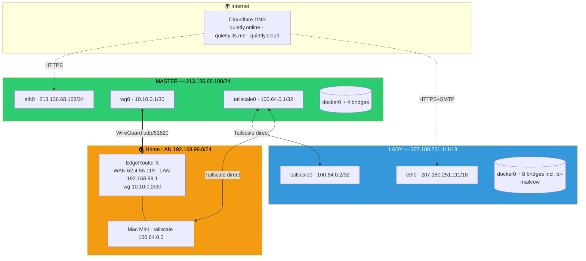

# 01 — Network Topology

> **Source**: `09-EVIDENCE/inv_master_20260423T201406Z.txt`, `inv_lady_20260423T201510Z.txt`  
> **Collected**: 2026-04-23 20:14–20:15 UTC  
> **Method**: `ip -o addr`, `ip route`, `tailscale status`, `wg show` — actual output, no assumptions  
> **Standard**: `~/.docs/00-standards/DOCUMENTATION_STANDARD.md` §Required Interface Specification Format

## 🌐 Mermaid overview



Verified from `tailscale status` on Master:

```
100.64.0.1  master  qui3tly  linux   -
100.64.0.2  lady    lady     linux   active; direct 207.180.251.111:41641
100.64.0.3  mac     qui3tly  macOS   active; direct 79.143.107.91:41641
```

Verified from `wg show` on Master:

```
peer G72JPy0...  endpoint 62.4.55.119:33358
allowed ips 10.10.0.0/30, 192.168.99.0/24
latest handshake 29 seconds ago   tx 19.36 GiB  rx 3.26 GiB
```

## 📐 Old-school interface table (actual values from `ip -o addr`)

### MASTER — 213.136.68.108

```
═══════════════════════════════════════════════════════════════
 Device            Family  Address              Scope    State
═══════════════════════════════════════════════════════════════
● lo              inet    127.0.0.1/8          host     UP
● eth0            inet    213.136.68.108/24    global   UP
                  ↳ gateway 213.136.68.1
● wg0             inet    10.10.0.1/30         global   UP
                  ↳ WireGuard; listen udp/51820
                  ↳ peer: EdgeRouter (62.4.55.119:33358)
                  ↳ allowed-ips: 10.10.0.0/30, 192.168.99.0/24
● tailscale0      inet    100.64.0.1/32        global   UP
                  ↳ virtual; MTU 1280; WireGuard via tailscaled
● br-0341e55be098 inet    172.30.0.1/24        global   UP   (monitoring)
● docker0         inet    172.17.0.1/16        global   UP   (default bridge)
● br-ca56054321aa inet    172.70.9.1/29        global   UP   (pihole_internal)
● br-fb776b4784ae inet    172.18.0.1/16        global   UP   (traefik)
═══════════════════════════════════════════════════════════════
```

Docker networks (`docker network ls`): 5 non-default — `monitoring`, `pihole_internal`, `traefik`, plus `bridge/host/none`.

### LADY — 207.180.251.111

```
═══════════════════════════════════════════════════════════════
 Device            Family  Address              Scope    State
═══════════════════════════════════════════════════════════════
● lo              inet    127.0.0.1/8          host     UP
● eth0            inet    207.180.251.111/18   global   UP
                  ↳ gateway 207.180.192.1 (subnet 207.180.192.0/18)
● tailscale0      inet    100.64.0.2/32        global   UP
● br-f55304df6a53 inet    172.23.0.1/16        global   UP   (unifi_unifi)
● br-f9e210a1a2f7 inet    172.21.0.1/16        global   UP   (portainer-agent_default)
● br-12d346c9fe84 inet    172.19.0.1/16        global   UP   (monitoring)
● br-44fe5bc60875 inet    172.20.0.1/16        global   UP   (nextcloud_nextcloud)
● br-64228b449149 inet    172.18.0.1/16        global   UP   (traefik)
● br-mailcow      inet    172.28.1.1/24        global   UP   (mailcow-network)
● docker0         inet    172.17.0.1/16        global   UP
● br-f49159028a5d inet    172.22.0.1/16        global   UP   (odoo-internal)
═══════════════════════════════════════════════════════════════
```

Docker networks: 8 non-default (`traefik`, `monitoring`, `mailcowdockerized_mailcow-network`, `nextcloud_nextcloud`, `portainer-agent_default`, `odoo-internal`, `unifi_unifi`, plus `bridge/host/none`).

## 🚚 Routing tables (actual, from `ip route`)

### MASTER

| Destination | Via / Dev | Source | Notes |
|---|---|---|---|
| `default` | `213.136.68.1` dev `eth0` | — | Contabo upstream |
| `10.10.0.0/30` | dev `wg0` | `10.10.0.1` | P2P tunnel |
| `172.17.0.0/16` | dev `docker0` | `172.17.0.1` | **linkdown** |
| `172.18.0.0/16` | dev `br-fb776b4784ae` | `172.18.0.1` | traefik |
| `172.30.0.0/24` | dev `br-0341e55be098` | `172.30.0.1` | monitoring |
| `172.70.9.0/29` | dev `br-ca56054321aa` | `172.70.9.1` | pihole_internal |
| `192.168.99.0/24` | dev `wg0` scope link | — | home LAN via WG |
| `213.136.68.0/24` | dev `eth0` kernel | `213.136.68.108` | attached |

### LADY

| Destination | Via / Dev | Source |
|---|---|---|
| `default` | `207.180.192.1` dev `eth0` | — |
| `172.17.0.0/16` | `docker0` | `172.17.0.1` (linkdown) |
| `172.18.0.0/16` | `br-64228b449149` | traefik |
| `172.19.0.0/16` | `br-12d346c9fe84` | monitoring |
| `172.20.0.0/16` | `br-44fe5bc60875` | nextcloud |
| `172.21.0.0/16` | `br-f9e210a1a2f7` | portainer-agent |
| `172.22.0.0/16` | `br-f49159028a5d` | odoo-internal |
| `172.23.0.0/16` | `br-f55304df6a53` | unifi |
| `172.28.1.0/24` | `br-mailcow` | mailcow |
| `207.180.192.0/18` | `eth0` kernel | attached |

No overlapping subnets. No unexpected default routes. ✅

## 🛡️ DNS bootstrap

Master `/etc/resolv.conf`:
```
nameserver 1.1.1.1
nameserver 8.8.8.8
```

**Immutable flag verified** (`lsattr`):
```
----i---------e------- /etc/resolv.conf
```
✅ Matches governance.

Lady `/etc/resolv.conf`:
```
nameserver 100.64.0.1   ← pihole on Master via Tailscale
nameserver 1.1.1.1      ← fallback
search qui3tly.cloud
```

## 📊 Drift vs. docs

| # | Item | Doc claim | Reality | Drift | Finding |
|---|---|---|---|---|---|
| 1 | Master containers | 25 | 25 | none ✅ | — |
| 2 | Lady containers | 39 | 38 | -1 | F-0006 |
| 3 | EdgeRouter WAN | `178.20.30.40` | `62.4.55.119` | drift | F-0007 |
| 4 | Resolv.conf immutable | claimed | confirmed | ✅ | — |
| 5 | Lady DNS primary | `10.10.0.1` (WG) | `100.64.0.1` (TS) | correct (Lady not on WG) | — |
| 6 | `br-mailcow 172.28.1.0/24` | not mentioned | present | doc gap | tracked under 06A |

## 🔗 Cross-refs

- Service maps: `02_SERVICE_INVENTORY_MASTER.md`, `03_SERVICE_INVENTORY_LADY.md`
- Systemd: `08_SYSTEMD_UNITS.md`
- UFW/ports: `../02-SECURITY_ANALYSIS/01_FIREWALL_AUDIT.md`, `02_PORT_EXPOSURE.md`
