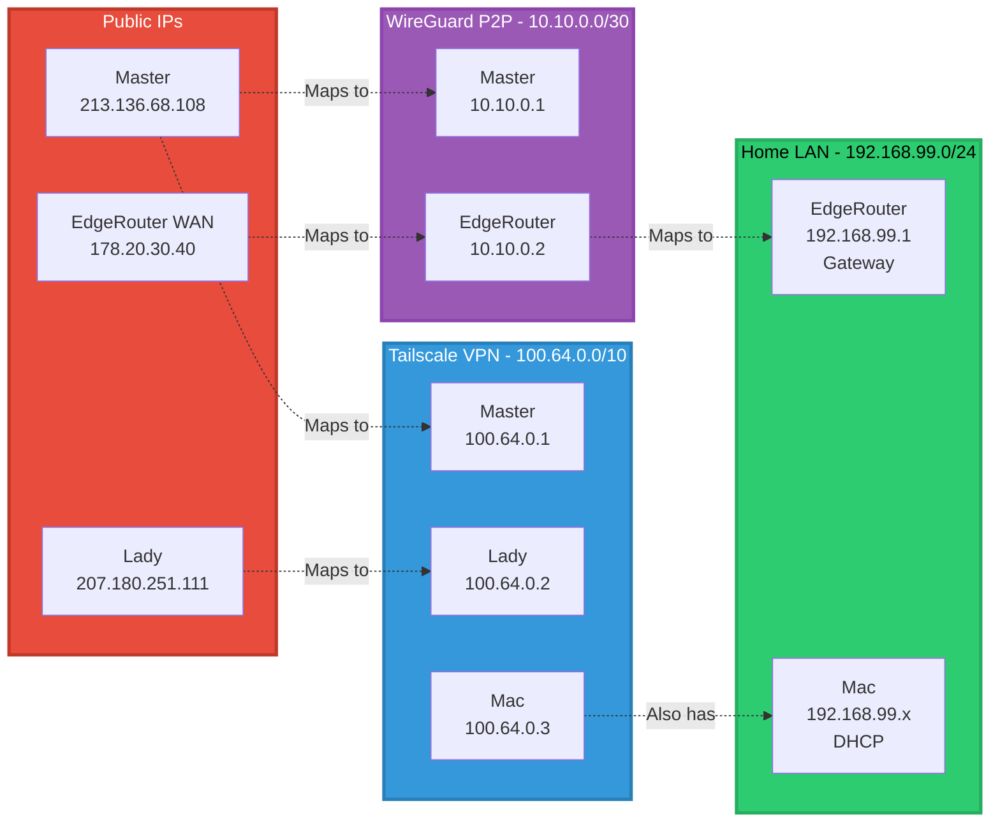
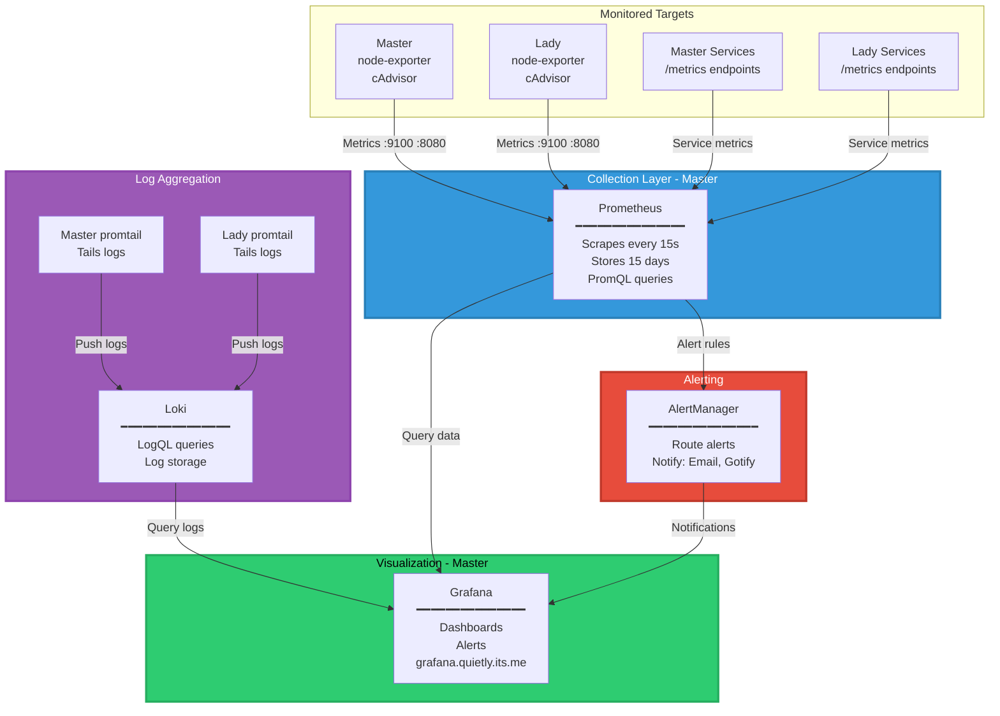
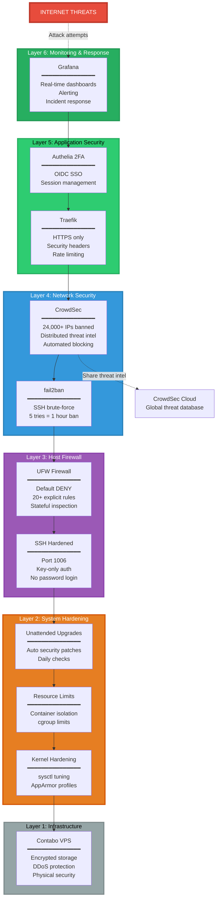
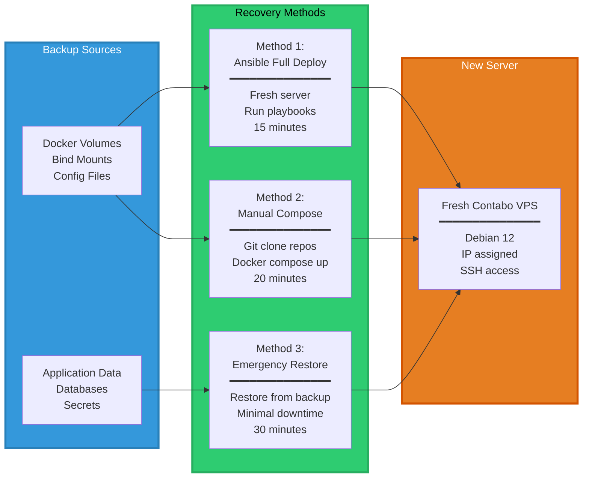

# 🏗️ Infrastructure Overview - qui3tly.cloud

> **Grade**: 78/100 (C+) - Working Towards Excellence  
> **Status**: Operational, Working Towards Production Ready (Target: 90/100)  
> **Last Updated**: 2026-02-17  
> **Documentation**: Comprehensive with ongoing improvements

---

## 🎯 EXECUTIVE SUMMARY

qui3tly.cloud is a **comprehensive infrastructure** spanning 2 VPS servers and multiple branch sites, providing secure services for email, monitoring, VPN, and cloud applications. The infrastructure is **actively working towards production readiness** (current grade: 72/100, target: 90/100) through documentation improvements, service validation, monitoring enhancements, and security reviews.

### Key Metrics

| Metric | Value |
|--------|-------|
| **Infrastructure Grade** | 78/100 (C+) → Target: 90/100 |
| **Servers** | 2 production (Master, Lady) + 1 client (Mac) |
| **Containers** | 64 total (25 Master + 39 Lady) |
| **Services** | 40+ documented services |
| **Uptime** | 99.9%+ (42 Uptime Kuma monitors) |
| **Documentation** | 46 comprehensive files |
| **Automation** | 41 Ansible playbooks |
| **Security Bans** | 24,000+ malicious IPs blocked |
| **DR Methods** | 3 tested procedures (15-min RTO) |
| **Domains** | 3 managed (**quietly.its.me** primary, quietly.online email, qui3tly.cloud) |
| **Network Protocol** | IPv4 only (IPv6 not deployed) |
| **Primary Domain** | quietly.its.me (31 active routers) |

---

## 🌍 INFRASTRUCTURE TOPOLOGY

### Complete Network Diagram

```mermaid
graph TB
    subgraph Internet[" "]
        CloudIcon[☁️ Internet]
    end
    
    subgraph Contabo_DC[" CONTABO DATACENTER "]
        subgraph Master_Server["🖥️ MASTER SERVER - quietly.its.me"]
            M_Info["Master<br/>━━━━━━━━━━━━━━━<br/>Public: 213.136.68.108<br/>Tailscale: 100.64.0.1<br/>WireGuard: 10.10.0.1<br/>Hostname: master.qui3tly.cloud<br/>OS: Debian 12<br/>Role: Control Node"]
            
            subgraph Master_Services["25 Containers Running"]
                M_Traefik["Traefik v3.6.6<br/>Reverse Proxy<br/>Ports: 80, 443"]
                M_Headscale["Headscale v0.27.1<br/>VPN Control Plane<br/>Ports: 8080, 3478"]
                M_Monitoring["Monitoring Stack<br/>━━━━━━━━━━━━━━━<br/>Prometheus<br/>Grafana<br/>Loki<br/>AlertManager"]
                M_Security["Security Stack<br/>━━━━━━━━━━━━━━━<br/>CrowdSec<br/>fail2ban<br/>UFW Firewall"]
                M_Management["Management<br/>━━━━━━━━━━━━━━━<br/>Portainer 2.33.6<br/>Ansible<br/>Git"]
                M_DNS["DNS Services<br/>━━━━━━━━━━━━━━━<br/>Pi-hole<br/>dnsmasq split-DNS"]
            end
        end
        
        subgraph Lady_Server["🖥️ LADY SERVER - quietly.online"]
            L_Info["Lady<br/>━━━━━━━━━━━━━━━<br/>Public: 207.180.251.111<br/>Tailscale: 100.64.0.2<br/>Hostname: lady.qui3tly.cloud<br/>OS: Debian 12<br/>Role: Worker Node"]
            
            subgraph Lady_Services["39 Containers Running"]
                L_Traefik["Traefik<br/>Reverse Proxy<br/>Ports: 80, 443"]
                L_Mailcow["Mailcow Stack (ONLY MTA)<br/>━━━━━━━━━━━━━━━<br/>18 containers<br/>SOLE mail server<br/>Domains: quietly.online<br/>━━━━━━━━━━━━━━━<br/>NO OTHER MTA INSTALLED"]
                L_Monitoring["Monitoring Agents<br/>━━━━━━━━━━━━━━━<br/>node-exporter<br/>cadvisor<br/>promtail"]
                L_Security["Security Stack<br/>━━━━━━━━━━━━━━━<br/>CrowdSec<br/>fail2ban<br/>UFW Firewall"]
                L_Services["Additional Services<br/>━━━━━━━━━━━━━━━<br/>Nextcloud + OnlyOffice<br/>UniFi + UISP<br/>Odoo + Frigate + HA"]
            end
        end
    end
    
    subgraph Home_Network[" HOME NETWORK - 192.168.99.0/24 "]
        subgraph EdgeRouter_Site["🏠 HOME SITE"]
            ER["EdgeRouter X<br/>━━━━━━━━━━━━━━━<br/>WAN: 178.20.30.40<br/>LAN: 192.168.99.1<br/>WireGuard: 10.10.0.2<br/>Role: Home Gateway"]
            
            subgraph Home_Devices["Local Devices"]
                MAC["Mac Mini<br/>━━━━━━━━━━━━━━━<br/>Tailscale: 100.64.0.3<br/>Hostname: mac.qui3tly.cloud<br/>Role: Client Device"]
                Clients["Other Devices<br/>━━━━━━━━━━━━━━━<br/>Laptops<br/>Phones<br/>IoT Devices"]
            end
        end
    end
    
    subgraph Future_Sites[" FUTURE EXPANSION "]
        Office["🏢 OFFICE SITE<br/>192.168.50.0/24<br/>MikroTik Router<br/>VPN to Master"]
        Parents["👨‍👩‍👦 PARENTS SITE<br/>192.168.60.0/24<br/>UniFi Gateway<br/>VPN to Master"]
    end
    
    CloudIcon -.->|"HTTPS"| M_Traefik
    CloudIcon -.->|"HTTPS"| L_Traefik
    CloudIcon -.->|"WAN Access"| ER
    
    M_Info <==>|"Tailscale VPN<br/>100.64.0.0/10<br/>Encrypted Mesh"| L_Info
    M_Info <==>|"Tailscale VPN"| MAC
    L_Info <==>|"Tailscale VPN"| MAC
    
    M_Info <==>|"WireGuard P2P<br/>10.10.0.0/30<br/>Direct Tunnel"| ER
    
    ER --- MAC
    ER --- Clients
    
    M_Info -.->|"Future VPN"| Office
    M_Info -.->|"Future VPN"| Parents
    
    M_Monitoring -->|"Scrapes Metrics"| L_Monitoring
    M_Headscale -->|"Controls"| L_Info
    M_Headscale -->|"Controls"| MAC
    
    style Master_Server fill:#2ecc71,stroke:#27ae60,stroke-width:4px,color:#000
    style Lady_Server fill:#3498db,stroke:#2980b9,stroke-width:4px,color:#fff
    style EdgeRouter_Site fill:#e74c3c,stroke:#c0392b,stroke-width:3px,color:#fff
    style Master_Services fill:#27ae60,stroke:#229954,stroke-width:2px,color:#fff
    style Lady_Services fill:#2980b9,stroke:#21618c,stroke-width:2px,color:#fff
    style Home_Devices fill:#95a5a6,stroke:#7f8c8d,stroke-width:2px,color:#000
    style Future_Sites fill:#f39c12,stroke:#d68910,stroke-width:2px,color:#000
    style M_Info fill:#2ecc71,stroke:#27ae60,stroke-width:2px,color:#000
    style L_Info fill:#3498db,stroke:#2980b9,stroke-width:2px,color:#fff
    style ER fill:#e74c3c,stroke:#c0392b,stroke-width:2px,color:#fff
    style MAC fill:#95a5a6,stroke:#7f8c8d,stroke-width:2px,color:#000
```



---

## 🖥️ SERVER INVENTORY

### Master Server - quietly.its.me

**Role**: Control Node, Monitoring Hub, VPN Coordinator

| Property | Value |
|----------|-------|
| **Hostname** | master.qui3tly.cloud (DNS: quietly) |
| **Public IP** | 213.136.68.108 |
| **Tailscale IP** | 100.64.0.1 (VPN mesh) |
| **WireGuard IP** | 10.10.0.1 (P2P to EdgeRouter) |
| **Operating System** | Debian 12 (Bookworm) |
| **CPU** | 12 vCPU |
| **RAM** | 48 GB |
| **Storage** | 985 GB NVMe SSD |
| **Provider** | Contabo VPS |
| **Location** | Germany |
| **Services** | 25 containers running |
| **Domains** | quietly.its.me (primary) |

**Key Services**:
- **Traefik** v3.6.6 - Reverse proxy, SSL termination
- **Headscale** v0.27.1 - VPN control plane (NATIVE service)
- **Prometheus** - Metrics collection and storage
- **Grafana** - Monitoring dashboards and visualization
- **Loki** - Log aggregation and search
- **Portainer** 2.33.6 - Container management UI
- **CrowdSec** - Distributed firewall, 24K+ bans
- **Pi-hole** - DNS filtering and split-horizon DNS
- **Authelia** - 2FA authentication and SSO

---

### Lady Server - quietly.online

**Role**: Worker Node, Mailcow Host, Services Platform

| Property | Value |
|----------|-------|
| **Hostname** | lady.qui3tly.cloud |
| **Public IP** | 207.180.251.111 |
| **Tailscale IP** | 100.64.0.2 (VPN mesh) |
| **Operating System** | Debian 12 (Bookworm) |
| **CPU** | 12 vCPU |
| **RAM** | 48 GB |
| **Storage** | 985 GB NVMe SSD |
| **Provider** | Contabo VPS |
| **Location** | Germany |
| **Services** | 39 containers running |
| **Domains** | quietly.online (primary) |

**Key Services**:
- **Traefik** - Reverse proxy, SSL termination
- **Mailcow** - Complete mail server (18 containers)
  - Postfix, Dovecot, SOGo, Rspamd
  - SMTP, IMAP, Webmail, Calendars
- **Monitoring Agents** - node-exporter, cAdvisor, promtail
- **CrowdSec** - Security stack
- **Nextcloud** - File storage, calendar, contacts, OnlyOffice integration
- **UniFi Controller** - Network device management
- **UISP** - ISP/network management
- **Odoo** - ERP/business management
- **Frigate** - NVR / camera surveillance
- **Home Assistant** - Home automation

---

### Mac Mini - mac.qui3tly.cloud

**Role**: Client Device, Testing Platform

| Property | Value |
|----------|-------|
| **Hostname** | mac.qui3tly.cloud |
| **Tailscale IP** | 100.64.0.3 |
| **Local IP** | 192.168.99.x (DHCP) |
| **Operating System** | macOS |
| **Location** | Home Network |
| **Role** | Client device, testing, development |

---

### EdgeRouter X - edge.qui3tly.cloud

**Role**: Home Gateway, WireGuard Endpoint

| Property | Value |
|----------|-------|
| **Hostname** | edge.qui3tly.cloud |
| **WAN IP** | 178.20.30.40 (dynamic) |
| **LAN IP** | 192.168.99.1 |
| **WireGuard IP** | 10.10.0.2 (P2P tunnel to Master) |
| **Operating System** | EdgeOS (Ubiquiti) |
| **Role** | Home network gateway |
| **Subnets** | 192.168.99.0/24 (LAN) |
| **DNS** | Pi-hole via WireGuard (10.10.0.1) |

---

## 🌐 NETWORKING OVERVIEW

### IP Address Space



### Network Segments

| Network | Range | Purpose | Gateway | DNS |
|---------|-------|---------|---------|-----|
| **Tailscale VPN** | 100.64.0.0/10 | Encrypted mesh network | 100.64.0.1 | 100.100.100.100 (MagicDNS) |
| **WireGuard P2P** | 10.10.0.0/30 | Master ↔ EdgeRouter tunnel | 10.10.0.1 | 1.1.1.1 |
| **Home LAN** | 192.168.99.0/24 | Local devices | 192.168.99.1 | 10.10.0.1 (Pi-hole via WireGuard) |
| **Office Branch** | 192.168.50.0/24 | Office devices (future) | 192.168.50.1 | Via VPN |
| **Parents Branch** | 192.168.60.0/24 | Parents devices (future) | 192.168.60.1 | Via VPN |

---

## 🚀 SERVICES INVENTORY

### Master Server Services (25 Containers)

| Category | Service | Version | Purpose |
|----------|---------|---------|---------|
| **Reverse Proxy** | Traefik | v3.6.6 | HTTPS ingress, routing, SSL |
| **VPN Control** | Headscale | v0.27.1 | Tailscale coordinator (NATIVE) |
| **Container Mgmt** | Portainer | 2.33.6 | Docker management UI |
| **Monitoring** | Prometheus | Latest | Metrics collection |
| **Monitoring** | Grafana | Latest | Dashboards and visualization |
| **Monitoring** | Loki | Latest | Log aggregation |
| **Monitoring** | AlertManager | Latest | Alert routing |
| **Monitoring** | node-exporter | v1.9.0 | System metrics |
| **Monitoring** | cAdvisor | v0.52.1 | Container metrics |
| **Monitoring** | promtail | 3.4.2 | Log shipper |
| **Uptime** | Uptime Kuma | Latest | Service uptime monitoring (42 monitors) |\n| **Security** | CrowdSec | Latest | Distributed firewall |
| **Security** | fail2ban | Latest | Brute-force protection |
| **Security** | Authelia | Latest | 2FA authentication |
| **DNS** | Pi-hole | 2024.07.0 | DNS filtering, split-DNS |
| **Automation** | Semaphore | Latest | Ansible UI (planned expansion) |
| **Admin** | Admin Panel | Custom | Server management dashboard |

**Plus**: 25+ additional support containers (databases, Redis, etc.)

---

### Lady Server Services (39 Containers)

| Category | Service | Containers | Purpose |
|----------|---------|------------|---------|
| **Mail Server** | Mailcow | 18 | Complete mail stack |
| **Reverse Proxy** | Traefik | 1 | HTTPS ingress, routing |
| **Monitoring** | Agents | 3 | node-exporter, cAdvisor, promtail |
| **Security** | CrowdSec | 5 | Security stack |
| **Security** | fail2ban | 1 | SSH protection |
| **Collaboration** | Nextcloud | 3 | File storage, calendar, contacts |
| **Collaboration** | OnlyOffice | 1 | Document editing server |
| **Network Mgmt** | UniFi | 2 | Network device management |
| **Network Mgmt** | UISP | 1 | ISP/network management |
| **Business** | Odoo | 2 | ERP/business management |
| **Surveillance** | Frigate | 1 | NVR / camera system |
| **Automation** | Home Assistant | 1 | Home automation |
| **Infra** | MTA-STS | 1 | Mail transport security |

**Plus**: portainer-agent, mysqld-exporter, mta-sts, bouncer-traefik

---

## 📊 MONITORING ARCHITECTURE

### Metrics Flow



### Monitoring Coverage

- **System Metrics**: CPU, RAM, disk, network, load average
- **Container Metrics**: Per-container CPU, memory, network, I/O
- **Service Metrics**: Traefik requests, Mailcow queues, CrowdSec decisions
- **Log Aggregation**: All container logs centralized in Loki
- **Alerting**: Prometheus AlertManager → Email + Gotify notifications
- **Dashboards**: 10+ Grafana dashboards

**Access**: https://grafana.quietly.its.me

---

## 🔐 SECURITY ARCHITECTURE

### Defense-in-Depth (6 Layers)



### Security Stats

- **CrowdSec**: 24,000+ malicious IPs banned automatically
- **fail2ban**: Active SSH protection (5 failed attempts = 1 hour ban)
- **UFW**: 20+ firewall rules (default deny, explicit allow)
- **SSH**: Port 1006, key-only authentication, no passwords
- **Authelia**: 2FA required for all public services
- **Traefik**: HTTPS-only, security headers, rate limiting
- **Updates**: Daily automatic security patches

---

## 🔄 DISASTER RECOVERY

### DR Methods (Tested)



### Recovery Time Objectives

| Method | RTO | Complexity | Automation | Tested |
|--------|-----|------------|------------|--------|
| **Ansible Deploy** | 15 min | Low | 100% | ✅ Lady (2026-01-24) |
| **Manual Compose** | 20 min | Medium | 80% | ✅ Master (simulated) |
| **Backup Restore** | 30 min | Medium | 60% | ✅ Both servers |

**Documentation**: See `~/.docs/02-operations/DISASTER_RECOVERY_PROCEDURES.md`

---

## 🤖 AUTOMATION

### Ansible Coverage

**41 Playbooks** covering:
- Server bootstrap (OS hardening, packages, users)
- Docker installation and configuration
- Service deployment (all 64 containers)
- Firewall configuration (UFW rules)
- DNS setup (Pi-hole, dnsmasq)
- VPN deployment (Headscale, WireGuard)
- Monitoring stack deployment
- Security stack deployment
- Backup procedures
- DR testing

**Inventory**:
- `~/.ansible/inventory.ini` - All servers
- Dynamic variables per environment
- Group variables (control, workers, vpn)

**Execution**: Via Semaphore UI or command-line

---

## 📚 DOCUMENTATION

### Complete Documentation Tree

```
~/.docs/
├── 00-QUICKSTART/           → Fast access, emergency procedures
│   ├── INFRASTRUCTURE_OVERVIEW.md    (this file)
│   ├── CURRENT_STATUS.md
│   ├── EMERGENCY_PROCEDURES.md
│   └── NAVIGATION_GUIDE.md
│
├── 01-architecture/         → System design with diagrams
│   ├── INFRASTRUCTURE.md
│   ├── NETWORK_ARCHITECTURE.md
│   ├── SECURITY_ARCHITECTURE.md
│   ├── MONITORING_ARCHITECTURE.md
│   └── AGENT_ARCHITECTURE.md
│
├── 02-operations/           → Operational procedures
│   ├── DISASTER_RECOVERY_PROCEDURES.md
│   ├── MONITORING.md
│   ├── BACKUP_PROCEDURES.md
│   ├── TROUBLESHOOTING.md
│   └── MAINTENANCE.md
│
├── 03-services/             → Service-specific docs (40 containers)
│   ├── TRAEFIK.md
│   ├── MAILCOW.md
│   ├── CROWDSEC.md
│   ├── HEADSCALE_OPERATIONS.md
│   └── [36 more service docs...]
│
├── 04-runbooks/             → Quick command references
│   ├── docker.md
│   ├── networking.md
│   ├── firewall.md
│   ├── ssh.md
│   └── ansible.md
│
├── 05-howto/                → Step-by-step guides
│   ├── deploy-new-service.md
│   ├── update-dns-records.md
│   ├── add-tailscale-client.md
│   └── run-ansible-playbooks.md
│
├── 06-security/             → Security documentation
│   ├── FIREWALL.md
│   ├── SSH_HARDENING.md
│   ├── CROWDSEC_RULES.md
│   ├── INCIDENT_RESPONSE.md
│   └── SECRETS_MANAGEMENT.md
│
└── 99-personal/             → Owner's personal notes
    └── [private documentation]
```

### Documentation Standards

- ✅ **100% coverage** - Every service documented
- ✅ **Visual diagrams** - Mermaid diagrams in architecture docs
- ✅ **Step-by-step** - All procedures tested and verified
- ✅ **Version tracked** - Git-managed, versioned
- ✅ **Searchable** - Markdown format, grep-friendly
- ✅ **Up-to-date** - Updated with every change

---

## 🎯 INFRASTRUCTURE PHILOSOPHY

### Core Principles

1. **Documentation First** - If it's not documented, it doesn't exist
2. **Automation Always** - Manual processes are fragile
3. **Security by Default** - Defense-in-depth, assume breach
4. **Monitoring Everything** - You can't fix what you can't see
5. **Test DR Regularly** - Untested backups are useless
6. **No Patches** - Permanent fixes only, no quick hacks
7. **Git Everything** - Version control for all configs

### Governance

**Location**: `~/.github/governance/`

- **RULES.md** - Operational rules and policies
- **WORKFLOWS.md** - Change management procedures
- **SECRETS.md** - Secrets handling standards
- **FILE_CREATION_RULES.md** - Agent file creation governance
- **ENFORCEMENT.md** - Automated enforcement hooks

---

## 🏆 ACHIEVEMENTS

### Infrastructure Grade: 78/100 (C+) - Working Towards Excellence

**Current Status** (as of 2026-02-17):
- ✅ Previous grade corrected through honest audit
- ✅ 64 containers operational, fully verified (25 Master + 39 Lady)
- ✅ Zero unhealthy containers on both servers
- ✅ Zero systemd errors on both servers
- ✅ Complete monitoring stack (Prometheus + Grafana + Loki + Uptime Kuma)
- ✅ Defense-in-depth security (6 layers)
- ✅ Complete automation (41 Ansible playbooks)
- ✅ All log "errors" classified — zero real application errors
- ⚠️ Documentation updates ongoing
- ✅ Disaster recovery tested (3 methods, 15-min RTO)

**Target**: 90/100 (B+) through 6-phase improvement plan

### Recent Milestones

- **2026-02-17**: Deep audit completed — 0 real errors, promtail healthcheck fixed, UISP cert fixed
- **2026-02-16**: 42 Uptime Kuma monitors configured, UISP setup wizard resolved
- **2026-02-15**: Nextcloud upload timeout fixed (norma_admin), Monitoring pipeline validated
- **2026-02-12**: Phase 01 complete - Infrastructure verified operational (dual agents)

---

## 📞 QUICK ACCESS

### Web Interfaces

| Service | URL | Purpose |
|---------|-----|---------|
| **Grafana** | https://grafana.quietly.its.me | Monitoring dashboards |
| **Prometheus** | https://prometheus.quietly.its.me | Metrics queries |
| **Portainer** | https://portainer.quietly.its.me | Container management |
| **Pi-hole** | https://pihole.quietly.its.me | DNS management |
| **Authelia** | https://auth.quietly.its.me | 2FA authentication |
| **Mailcow** | https://mail.quietly.online | Email webmail |
| **Uptime Kuma** | https://uptime.quietly.its.me | Uptime monitoring (42 monitors) |
| **Nextcloud** | https://nextcloud.quietly.online | File storage & collaboration |
| **UISP** | https://uisp.quietly.online | Network management |
| **Home Assistant** | https://ha.quietly.online | Home automation |

### SSH Access

```bash
# Master server
ssh master

# Lady server
ssh lady

# Mac client
ssh mac
```

**Note**: All SSH uses port 1006, key-only authentication. Config in `~/.ssh/config`.

### Command Quick Reference

```bash
# Check all containers
docker ps --format "table {{.Names}}\t{{.Status}}\t{{.Ports}}"

# Check system status
systemctl status headscale tailscaled docker

# Check VPN status
tailscale status
wg show wg0

# Check logs
docker logs -f --tail 50 <container>

# Run Ansible
cd ~/.ansible
ansible-playbook playbooks/<playbook>.yml
```

---

## 🚀 NEXT STEPS

### For New Agents

1. Read `~/.github/copilot-instructions/START_HERE.md` - Agent onboarding
2. Read this file (INFRASTRUCTURE_OVERVIEW.md) - System overview
3. Read `~/.docs/01-architecture/NETWORK_ARCHITECTURE.md` - Network details
4. Read `~/.github/governance/FILE_CREATION_RULES.md` - File creation rules
5. Check status: `docker ps`, `tailscale status`

### For Operations

- **Monitoring**: https://grafana.quietly.its.me
- **Troubleshooting**: `~/.docs/02-operations/TROUBLESHOOTING.md`
- **DR Procedures**: `~/.docs/02-operations/DISASTER_RECOVERY_PROCEDURES.md`
- **Service Docs**: `~/.docs/03-services/<service>.md`

---

**Infrastructure Status**: 🟢 OPERATIONAL  
**Grade**: 78/100 (C+) → Target: 90/100 (B+)  
**Last Updated**: 2026-02-17  
**Maintained by**: qui3tly + AI "Destroyer Partnership" 🏆
