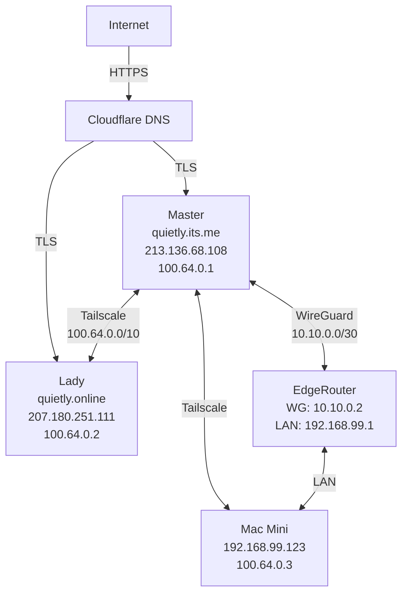

# Implementation Plan - Preproduction qui3tly.cloud

> **Project**: Excellence Initiative  
> **Duration**: 30+ days (6+ weeks)  
> **Start**: 2026-01-22  
> **Target**: 2026-02-22  
> **Current Grade**: A- (9.0/10)  
> **Target Grade**: A+++ (10/10)

---

## EXECUTION STRATEGY

### Philosophy

This is **NOT a rewrite**. This is **systematic excellence** through:
1. **Fix** critical errors (Week 1)
2. **Complete** missing documentation (Weeks 2-3)
3. **Polish** existing work (Weeks 4-5)
4. **Enhance** with world-class features (Week 6+)

Every change follows **7-step governance workflow**:
1. Investigate → 2. Test → 3. Backup → 4. Confirm → 5. Execute → 6. Verify → 7. Document

---

### DR & Access Constraints (Non-Negotiable)

- **Headscale DR IP retention**: Master must run a Headscale DR playbook to delete the old Lady node, VACUUM the DB, and re-register Lady to retain Tailnet IP 100.64.0.2.
- **Initial access**: first login to a fresh server uses admin/password only (admin:RaMpulstilckin123!), then switch to qui3tly SSH key-only.
- **Secrets transfer**: copy required secrets from Master before service deploy (Cloudflare, Tailscale authkey, Mailcow, Traefik, etc.).
- **Playbook order**: initial-access → bootstrap/hardening → GitHub → Traefik → CrowdSec → Portainer → Tailscale → Mailcow → remaining compose-only services.
- **Backup restore**: Pi-hole/DNS, WireGuard, and Tailscale must retain IP addresses when restoring from backup.
- **GitHub**: token is shared; each repo must retain its own .git and .gitignore.
- **Semaphore projects**: separate projects for Master/Lady/Madam with shared + host-specific playbooks.
- **Worker scope**: workers run only Portainer agent + monitoring agents reporting to Master.

## PHASE 1: QUICK WINS (Week 1)

**Goal**: Fix all critical errors  
**Duration**: Week 1 (Jan 22-28)  
**Effort**: 2.5 hours  
**Grade**: C+ 7.0 → B 8.0  
**Status**: ✅ COMPLETE (2026-01-23)

### Day 1-2: Critical Errors (65 minutes)

#### Task 1.1: Fix Lady Container Count (10 min)
**Files to Update**:
- [INFRASTRUCTURE.md](../../../.docs/architecture/INFRASTRUCTURE.md)
- [SERVERS.md](../../../.docs/architecture/SERVERS.md)
- [quietly.cloud/plans/STARTUP_PLAN.md](../../quietly.cloud/plans/STARTUP_PLAN.md)
- [quietly.cloud/RFP.md](../../quietly.cloud/RFP.md)

**Change**: 4 containers → 22 containers (18 Mailcow + 4 infra)

**Verification**:
```bash
ssh lady "docker ps --format '{{.Names}}' | wc -l"
# Should return: 22
```

#### Task 1.2: Fix Headscale Commands (10 min)
**Pattern**: Global find/replace in all markdown files

**Files Affected** (~13 occurrences):
- [HEADSCALE.md](../../../.docs/services/HEADSCALE.md)
- [NETWORK.md](../../../.docs/architecture/NETWORK.md)
- HOWTOs that reference Headscale

**Change**:
```bash
# WRONG (13 places)
docker exec -it headscale headscale nodes list

# CORRECT
sudo headscale nodes list
```

**Verification**:
```bash
# Search for remaining docker exec references
grep -r "docker exec.*headscale" ~/.docs/
# Should return: 0 results
```

#### Task 1.3: Fix Playbook Paths (10 min)
**Files to Update**:
- Architecture docs
- Deployment guides (DEPLOY_MASTER.md, DEPLOY_LADY.md)

**Change**:
```bash
# WRONG
~/ansible/traefik/deploy-traefik.yml

# CORRECT
~/.ansible/playbooks/master/traefik-deploy.yml
```

**Verification**:
```bash
# Check actual path
ls -la ~/.ansible/playbooks/{master,lady,shared}/*.yml
```

### Day 3: Firewall Documentation (15 min)

#### Task 1.4: Update Firewall Rules
**File**: [SECURITY.md](../../../.docs/security/SECURITY.md)

**Action**: Document all UFW rules

**Master Rules** (23):
```bash
sudo ufw status numbered | tee master-firewall.txt
```

**Lady Rules** (10):
```bash
ssh lady "sudo ufw status numbered" | tee lady-firewall.txt
```

**Document in SECURITY.md**:
- Rule purpose
- Port/service mapping
- Source restrictions
- Last review date

### Day 4: Missing Script Documentation (20 min)

#### Task 1.5: Document Missing Scripts
**Files Affected**:
- [DR-HOWTO.md](../../../.docs/operations/DR-HOWTO.md)
- Deployment guides

**Missing Scripts**:
1. `lady-dr.sh` - Referenced but doesn't exist
2. `deploy-dr.sh` - Referenced but doesn't exist
3. `lady-fresh-install.sh` - Referenced but doesn't exist

**Options**:
A. Update docs to reflect actual scripts (master-dr.sh exists)
B. Mark as TODO with specifications
C. Create placeholder scripts (Phase 2)

**Recommended**: Option A + B (update docs, mark for Phase 2 creation)

### Day 5: Quick Wins Testing (1 hour)

#### Task 1.6-1.15: Additional Quick Wins
**From QUICK_WINS.md**:
- Fix monitoring versions (Grafana 11.4.0, Prometheus v2.54.1)
- Fix Authelia version (4.39.15)
- Add Mailcow to SERVERS.md services list
- Update service counts
- Remove duplicate DNS info
- Fix broken links
- Update outdated diagrams
- Standardize formatting

#### Task 1.16: Verification
**Automated Checks**:
```bash
# Run verification script
cd ~/.copilot/scripts/
./verify-docs.sh

# Checks:
# - No broken internal links
# - All commands syntax-valid
# - All paths exist
# - No docker exec headscale remaining
# - Container counts match reality
```

**Manual Verification**:
- Owner reviews 3-5 critical docs
- Tests 3-5 commands
- Confirms accuracy

**Success Criteria**:
- ✅ All 15 quick wins complete
- ✅ Zero critical errors remaining
- ✅ All commands work as documented
- ✅ Grade improved to B (8.0)

---

## PHASE 2: CRITICAL DOCUMENTATION (Weeks 2-3)

**Goal**: Create missing operational guides  
**Duration**: Weeks 2-3 (Jan 29 - Feb 11)  
**Effort**: 24 hours  
**Grade**: B 8.0 → B+ 8.5  
**Status**: 📅 SCHEDULED

### Week 2 (Jan 29 - Feb 4): Mailcow + CrowdSec + Scripts

#### Day 1-2: MAILCOW.md (4 hours)

**Structure**:
```markdown
# Mailcow Operations Guide

## Architecture
- 18 container breakdown
- Service dependencies
- Integration with Traefik
- DNS requirements (MX, SPF, DKIM, DMARC)

## Configuration
- Admin interface access
- Domain management
- User/mailbox creation
- Alias configuration
- DKIM key generation

## Common Operations
- Add new domain
- Create mailbox
- Set up aliases
- Configure forwarding
- Quota management

## Troubleshooting
- DNS issues (MX record verification)
- TLS certificate problems
- Email delivery failures
- SPAM/DKIM issues
- Container health checks

## Backup & Restore
- Backup procedure (vmail, MySQL, Redis)
- Restore procedure
- Backup schedule
- Offsite backup strategy

## Updates
- Update procedure
- Rollback procedure
- Breaking changes checklist
- Testing before production

## Integration
- Traefik routing (mail.quietly.online)
- Cloudflare DNS
- Pi-hole split-horizon DNS
- CrowdSec protection

## Monitoring
- Container health
- Queue length
- Disk usage
- Log analysis

## Security
- Fail2ban rules
- CrowdSec integration
- User authentication
- TLS configuration
- Port restrictions

## References
- Official docs: https://docs.mailcow.email/
- Docker Compose: ~/.docker-compose/mailcow/
- Data location: ~/.docker/mailcow/
```

**Verification**:
- Test admin login
- Create test mailbox
- Send/receive test email
- Verify all procedures work

#### Day 3: CROWDSEC.md (3 hours)

**Structure**:
```markdown
# CrowdSec Operations Guide

## Architecture
- Decision engine (container)
- Traefik bouncer (container)
- Integration flow
- Alert types

## Alert Management
- Review alerts: `sudo cscli alerts list`
- Alert details: `sudo cscli alerts inspect <ID>`
- Alert types explained (scan, exploit, bruteforce)
- False positive identification

## Ban Management
- List bans: `sudo cscli decisions list`
- Ban IP: `sudo cscli decisions add --ip X.X.X.X`
- Unban: `sudo cscli decisions delete --ip X.X.X.X`
- Whitelist trusted IPs

## Threat Analysis
- Top attackers by country
- Attack patterns
- Recent trends (from audit: US/MA/GB/IN/BG)
- Effectiveness metrics

## Configuration
- Scenario tuning
- Collection management
- Parser customization
- Bouncer configuration

## Integration
- Traefik bouncer setup
- Log sources (traefik, authelia, pihole)
- Alert forwarding
- Dashboard access

## Maintenance
- Update CrowdSec: `docker compose pull && docker compose up -d`
- Update collections: `sudo cscli collections upgrade --all`
- Database cleanup
- Log rotation

## Troubleshooting
- Bouncer not blocking
- False positives
- Performance impact
- Log ingestion issues

## Monitoring
- Alert rate trends
- Ban effectiveness
- Bouncer health
- Database size

## References
- Official docs: https://docs.crowdsec.net/
- Audit findings: 163 alerts, 10 active bans
- Recent threats: SSH scans, HTTP exploits
```

**Verification**:
- List alerts (verify 163+ total)
- Test manual ban/unban
- Verify bouncer blocking
- Review alert types

#### Day 4: lady-dr.sh Script (2 hours)

**Based on master-dr.sh pattern**:
```bash
#!/bin/bash
# lady-dr.sh - Lady Server Disaster Recovery
# Usage: ./lady-dr.sh
# Prerequisites: Fresh Contabo VPS, root access

set -euo pipefail

echo "=== LADY DISASTER RECOVERY SCRIPT ==="
echo "Target: quietly.online (Lady)"
echo "Starting: $(date)"

# Phase 1: Base System Setup
echo "[1/7] Base system setup..."
apt update && apt upgrade -y
apt install -y git curl wget sudo ufw fail2ban

# Phase 2: User Creation
echo "[2/7] Creating qui3tly user..."
useradd -m -s /bin/bash qui3tly
usermod -aG sudo qui3tly

# Phase 3: SSH Hardening
echo "[3/7] SSH hardening (port 1006)..."
# Configure SSH (port 1006, key-only)

# Phase 4: Firewall
echo "[4/7] Firewall setup..."
# Configure UFW (10 rules for Lady)

# Phase 5: Docker Installation
echo "[5/7] Docker installation..."
curl -fsSL https://get.docker.com | bash
usermod -aG docker qui3tly

# Phase 6: Repository Clone
echo "[6/7] Cloning repositories..."
sudo -u qui3tly git clone git@github.com:qui3tly/quietly.online.git /home/qui3tly
sudo -u qui3tly git clone git@github.com:qui3tly/ansible.git /home/qui3tly/.ansible
# Read-only clones for shared repos

# Phase 7: Secrets Pause
echo "[7/7] PAUSING FOR SECRETS COPY"
echo "==============================================="
echo "ACTION REQUIRED:"
echo "1. Copy secrets to Lady:/home/qui3tly/.secrets/"
echo "   - 7 SSH keys (github, master, madam, beauty, mac, lady, edgerouter)"
echo "   - Mailcow configs"
echo "   - Cloudflare token"
echo "   - All service credentials"
echo "2. Set permissions: chmod 700 ~/.secrets, chmod 600 ~/.secrets/*"
echo "3. Press ENTER to continue deployment..."
read -p "Press ENTER when secrets are copied: "

# Phase 8: Deploy Infrastructure
echo "[8/8] Deploying Lady infrastructure..."
cd /home/qui3tly/.ansible
ansible-playbook -i inventory.ini playbooks/lady/lady-deploy.yml

echo "=== LADY DISASTER RECOVERY COMPLETE ==="
echo "Verify: ssh lady 'docker ps && systemctl status tailscaled'"
```

**Testing**:
- Dry-run on test VM
- Verify each phase
- Document actual timing
- Update DR-HOWTO.md

#### Day 5: deploy-dr.sh Script (2 hours)

**Orchestration Script**:
```bash
#!/bin/bash
# deploy-dr.sh - Full Infrastructure DR
# Deploys both Master and Lady in sequence

set -euo pipefail

echo "=== FULL INFRASTRUCTURE DISASTER RECOVERY ==="
echo "This will deploy Master, then Lady"
echo "Estimated time: 60-90 minutes"
read -p "Continue? (yes/no): " confirm
[[ "$confirm" != "yes" ]] && exit 1

# Phase 1: Deploy Master
echo "[1/2] Deploying Master..."
./master-dr.sh
if [ $? -ne 0 ]; then
    echo "ERROR: Master deployment failed"
    exit 1
fi

# Wait for Master services
echo "Waiting for Master services (60s)..."
sleep 60

# Health check Master
ssh master "docker ps --format '{{.Names}}\t{{.Status}}'" | grep -v "Up" && {
    echo "ERROR: Master services not healthy"
    exit 1
}

echo "Master: ✅ Healthy"

# Phase 2: Deploy Lady
echo "[2/2] Deploying Lady..."
./lady-dr.sh
if [ $? -ne 0 ]; then
    echo "ERROR: Lady deployment failed"
    echo "Master is operational, Lady needs manual intervention"
    exit 1
fi

# Final verification
echo "=== FINAL VERIFICATION ==="
echo "Master:"
ssh master "docker ps --format '{{.Names}}\t{{.Status}}' | head -5"
echo ""
echo "Lady:"
ssh lady "docker ps --format '{{.Names}}\t{{.Status}}' | head -5"
echo ""
echo "Tailscale:"
tailscale status | grep qui3tly

echo "=== FULL DR COMPLETE ==="
echo "RTO: $(date -d @$SECONDS -u +%H:%M:%S)"
```

### Week 3 (Feb 5-11): Headscale + DNS + DR Guide

#### Day 1-2: HEADSCALE_OPERATIONS.md (3 hours)

**Structure**:
```markdown
# Headscale Operations Guide

## Architecture
- Native installation (NOT Docker)
- Configuration: /etc/headscale/config.yaml
- Service: systemctl status headscale
- Port: 8080 (HTTP), 3478 (STUN)

## User Management
- Create user: `sudo headscale users create <name>`
- List users: `sudo headscale users list`
- Delete user: `sudo headscale users destroy <name>`

## Node Management
- List nodes: `sudo headscale nodes list`
- Register node: `sudo headscale nodes register --user <user> --key <key>`
- Delete node: `sudo headscale nodes delete <node-id>`
- Expire node: `sudo headscale nodes expire <node-id>`

## Preauthkeys
- Create: `sudo headscale preauthkeys create --user <user> --expiration 1h`
- List: `sudo headscale preauthkeys list`
- Expire: `sudo headscale preauthkeys expire --user <user> <key>`

## Routes
- List routes: `sudo headscale routes list`
- Approve route: `sudo headscale routes enable -r <route-id>`
- Delete route: `sudo headscale routes delete -r <route-id>`

## ACLs
- View ACL: `cat /etc/headscale/acl.json`
- Test ACL: `sudo headscale acl check`
- Reload ACL: `sudo systemctl reload headscale`

## MagicDNS
- Configuration in config.yaml
- Domain: qui3tly.cloud
- Resolution: 100.100.100.100
- Debugging: `dig @100.100.100.100 master.qui3tly.cloud`

## DERPMap
- Configuration: config.yaml derp.urls
- Test: `curl https://controlplane.tailscale.com/derpmap/default`
- Custom DERP servers (future)

## Troubleshooting
- Service logs: `journalctl -u headscale -f`
- Node connectivity: `sudo headscale nodes list`
- DNS issues: Check /etc/resolv.conf (must be 1.1.1.1)
- Restart: `sudo systemctl restart headscale`

## Integration
- Tailscale clients connect via http://100.64.0.1:8080
- MagicDNS domains: *.qui3tly.cloud
- Pi-hole integration for split-horizon DNS

## Monitoring
- Service status: `systemctl status headscale`
- Active nodes: `sudo headscale nodes list | wc -l`
- Routes advertised: `sudo headscale routes list`

## Backup
- Config: /etc/headscale/config.yaml
- Database: /var/lib/headscale/db.sqlite
- ACLs: /etc/headscale/acl.json

## Updates
- Update: `sudo apt update && sudo apt install headscale`
- Restart: `sudo systemctl restart headscale`
- Verify: `sudo headscale version`

## References
- Official docs: https://headscale.net/
- GitHub: https://github.com/juanfont/headscale
- Current version: v0.27.1
```

#### Day 3: DNS_ARCHITECTURE.md (4 hours)

**Structure with Mermaid Diagrams**:
```markdown
# DNS Architecture - qui3tly.cloud

## Overview

Three-layer DNS architecture combining Cloudflare (public), Pi-hole (private), and Tailscale MagicDNS (VPN).

## Network Diagram

[Mermaid diagram: Internet → Cloudflare → Pi-hole → Tailscale MagicDNS]

## Layer 1: Public DNS (Cloudflare)

**Domains**:
- quietly.its.me (Master)
- quietly.online (Lady)
- qui3tly.cloud (Tailnet FQDN)

**Records**:
[Table of all Cloudflare DNS records]

## Layer 2: Private DNS (Pi-hole)

**dnsmasq Configuration**:
- Files: ~/.docker/pihole/etc-dnsmasq.d/*.conf
- Purpose: Split-horizon DNS (internal IPs for internal clients)

**Example**: mail.quietly.online
- Public (Cloudflare): 207.180.251.111
- Private (Pi-hole dnsmasq): 100.64.0.2 (Tailnet IP)
- Used by: Tailscale clients

## Layer 3: VPN DNS (Tailscale MagicDNS)

**Configuration**:
- Domain: qui3tly.cloud
- Resolver: 100.100.100.100
- Nodes:
  - master.qui3tly.cloud → 100.64.0.1
  - lady.qui3tly.cloud → 100.64.0.2
  - mac.qui3tly.cloud → 100.64.0.3

## DNS Flow Scenarios

### Scenario 1: External Client → Master
[Mermaid diagram: Internet client → Cloudflare → 213.136.68.108]

### Scenario 2: Tailscale Client → Lady
[Mermaid diagram: VPN client → MagicDNS → 100.64.0.2]

### Scenario 3: EdgeRouter LAN → Master
[Mermaid diagram: LAN client → EdgeRouter → WireGuard → Pi-hole → 10.10.0.1]

## Configuration Files

**Cloudflare** (via Traefik):
- Token: ~/.secrets/cloudflare/token
- Plugin: CF DNS challenge

**Pi-hole dnsmasq**:
- Location: ~/.docker/pihole/etc-dnsmasq.d/
- Files: quietly-its-me.conf, quietly-online.conf, qui3tly-cloud.conf

**Headscale MagicDNS**:
- Config: /etc/headscale/config.yaml
- Domain: qui3tly.cloud
- Base domain: qui3tly.cloud

## Troubleshooting

**Test Public DNS**:
```bash
dig quietly.its.me +short
# Should return: 213.136.68.108
```

**Test Pi-hole**:
```bash
dig @10.10.0.1 mail.quietly.online +short
# Should return: 100.64.0.2
```

**Test MagicDNS**:
```bash
dig @100.100.100.100 lady.qui3tly.cloud +short
# Should return: 100.64.0.2
```

## Monitoring

- Cloudflare Analytics: analytics.cloudflare.com
- Pi-hole Query Log: http://quietly.its.me/admin/queries.php
- Headscale DNS: `sudo headscale nodes list`

## References
- Cloudflare Docs: https://developers.cloudflare.com/dns/
- Pi-hole Docs: https://docs.pi-hole.net/
- Headscale DNS: https://headscale.net/
```

#### Day 4: DISASTER_RECOVERY_PROCEDURES.md (4 hours)

**Complete DR Guide**:
```markdown
# Disaster Recovery Procedures

## Overview

Complete rebuild procedures for qui3tly.cloud infrastructure using automated DR scripts.

## Recovery Time Objectives (RTO/RPO)

| Server | RTO | RPO | Data Loss |
|--------|-----|-----|-----------|
| Master | 60 min | 24 hours | Minimal |
| Lady | 90 min | 24 hours | Email (1 day) |
| Full Infrastructure | 150 min | 24 hours | Minimal |

## Prerequisites

**Before Disaster**:
- ✅ Secrets backed up offsite (~/.secrets/ directory)
- ✅ Git repos pushed to GitHub (automated)
- ✅ DR scripts tested quarterly
- ✅ Fresh Contabo VPS can be provisioned

**For Recovery**:
- New Contabo VPS (same specs)
- Secrets archive (offsite)
- SSH access to new VPS
- GitHub access (SSH key)

## DR Scripts

| Script | Purpose | Time | Automation |
|--------|---------|------|------------|
| master-dr.sh | Master full rebuild | 60 min | 95% automated |
| lady-dr.sh | Lady full rebuild | 90 min | 90% automated |
| deploy-dr.sh | Both servers | 150 min | 85% automated |

## Procedure: Master DR

### Step 1: Provision VPS
- Order Contabo VPS (same specs)
- Note new IP address
- Access via Contabo console

### Step 2: Run DR Script
```bash
# Upload master-dr.sh to new VPS
scp master-dr.sh root@NEW_IP:/root/

# SSH to new VPS
ssh root@NEW_IP

# Run DR script
chmod +x master-dr.sh
./master-dr.sh
```

### Step 3: Copy Secrets
Script pauses for secrets copy:
```bash
# From workstation
scp -r ~/.secrets/ qui3tly@NEW_IP:/home/qui3tly/.secrets/
```

### Step 4: Verify
```bash
ssh qui3tly@NEW_IP
docker ps  # Should show 21 containers
systemctl status tailscaled headscale
```

### Step 5: Update DNS
- Cloudflare: Update quietly.its.me A record → NEW_IP
- Wait for propagation (5 min)

## Procedure: Lady DR

[Similar structure to Master DR]

## Procedure: Full Infrastructure DR

```bash
# Run orchestration script
./deploy-dr.sh

# Script will:
# 1. Deploy Master
# 2. Wait for Master health
# 3. Deploy Lady
# 4. Verify both servers
```

## Testing Schedule

**Quarterly** (Jan, Apr, Jul, Oct):
- Test Master DR (snapshot → deploy → verify → destroy)
- Test Lady DR (snapshot → deploy → verify → destroy)
- Update procedures based on findings
- Document actual RTO/RPO

**Annually** (January):
- Full infrastructure DR test
- Update all documentation
- Review and optimize scripts

## Secrets Management During DR

**Critical Secrets**:
- 7 SSH keys (github, servers, edgerouter)
- Cloudflare token
- Mailcow configs
- Service credentials
- TLS certificates (Let's Encrypt, auto-renewed)

**Backup Strategy**:
- Primary: ~/.secrets/ on both servers
- Offsite: Encrypted archive (owner's workstation)
- Verification: Monthly checksum

## Rollback Procedures

If DR fails:
1. Keep old server running (if possible)
2. Debug new server
3. Don't change DNS until verified
4. Document failure for improvement

## Communication Plan

During DR:
- Update status page (if available)
- Notify users (if applicable)
- Document timeline
- Post-mortem after completion

## References
- Scripts: ~/.copilot/scripts/
- Audit findings: RTO/RPO reasonable
- Last tested: [DATE]
- Next test: [DATE]
```

#### Day 5: DR-HOWTO.md Rewrite (3 hours)

**Rewrite based on actual working scripts**:
- Remove references to non-existent scripts
- Use actual script names (master-dr.sh, etc.)
- Verify all commands work
- Include real timing data
- Add verification steps

**Success Criteria Week 2-3**:
- ✅ 5 operational guides created
- ✅ 3 DR scripts created
- ✅ All procedures tested
- ✅ DR-HOWTO.md rewritten
- ✅ Grade: B+ (8.5)

---

## PHASE 3: PROFESSIONAL POLISH (Weeks 4-5)

**Goal**: Add diagrams, complete Ansible, consolidate  
**Duration**: Weeks 4-5 (Feb 12-25)  
**Effort**: 25 hours  
**Grade**: B+ 8.5 → A (9.3)  
**Status**: 📅 SCHEDULED

### Week 4 (Feb 12-18): Diagrams + Ansible

#### Day 1-2: Network & DNS Diagrams (4 hours)

**Diagram 1: Complete Network Topology**


**Diagram 2: DNS Flow (3 scenarios)**
**Diagram 3: Traefik Routing**
**Diagram 4: DR Workflow**

#### Day 3: Service Diagrams (2 hours)

**Diagram 5: Monitoring Architecture**
**Diagram 6: Mailcow Architecture (18 containers)**

#### Day 4: headscale-deploy.yml Playbook (3 hours)

**Create complete Headscale deployment playbook**:
```yaml
---
- name: Deploy Headscale (Native)
  hosts: master
  become: yes
  vars_files:
    - ../../group_vars/all.yml
  
  tasks:
    - name: Install dependencies
      apt:
        name:
          - wget
          - sqlite3
        state: present
    
    - name: Download Headscale binary
      get_url:
        url: "https://github.com/juanfont/headscale/releases/download/v{{ headscale_version }}/headscale_{{ headscale_version }}_linux_amd64"
        dest: /usr/local/bin/headscale
        mode: '0755'
    
    - name: Create Headscale directories
      file:
        path: "{{ item }}"
        state: directory
        mode: '0755'
      loop:
        - /etc/headscale
        - /var/lib/headscale
    
    - name: Copy configuration
      template:
        src: headscale-config.yaml.j2
        dest: /etc/headscale/config.yaml
        mode: '0644'
    
    - name: Copy systemd service
      copy:
        src: headscale.service
        dest: /etc/systemd/system/headscale.service
        mode: '0644'
    
    - name: Enable and start Headscale
      systemd:
        name: headscale
        enabled: yes
        state: started
        daemon_reload: yes
```

**Test on Master** (non-destructive, verify changes)

#### Day 5: Playbook Testing (3 hours)

**Test Matrix**:
- All 41 existing playbooks
- New headscale-deploy.yml
- Verify idempotency
- Document dependencies
- Update playbook README

### Week 5 (Feb 19-25): Security + Consolidation

#### Day 1: Security Diagrams (2 hours)

**Diagram 7: Security Layers (6 layers)**
**Diagram 8: CrowdSec Flow**
**Diagram 9: Agent Architecture**

#### Day 2-3: Script Consolidation (6 hours)

**Identify Duplicates**:
- Compare sync-repos.sh variants
- Compare monitoring checks
- Compare health checks

**Consolidate**:
- Create unified versions
- Update all references in docs
- Deprecate old versions (move to .deprecated/)

#### Day 4: Content Deduplication (4 hours)

**Remove Redundant Sections**:
- DNS info scattered across 3 docs → Move to DNS_ARCHITECTURE.md
- Network info in multiple places → Consolidate to NETWORK.md
- Service descriptions duplicated → Single source in SERVICES.md

**Update Cross-References**:
- Replace duplicates with links
- Maintain single source of truth

#### Day 5: Verification & Testing (3 hours)

**Comprehensive Verification**:
```bash
# Run all verification scripts
cd ~/.copilot/scripts/
./verify-docs.sh
./verify-scripts.sh
./verify-ansible.sh

# Manual checks
- All diagrams render
- All scripts execute
- All playbooks run
- All procedures work
```

**Success Criteria Week 4-5**:
- ✅ 9 diagrams created
- ✅ Complete Ansible coverage
- ✅ Scripts consolidated
- ✅ Content deduplicated
- ✅ Grade: A (9.3)

---

## PHASE 4: WORLD-CLASS EXCELLENCE (Week 6+)

**Goal**: Security enhancements, testing, perfection  
**Duration**: Week 6+ (Feb 26+)  
**Effort**: 24 hours  
**Grade**: A 9.3 → A+++ 10.0  
**Status**: 📅 FUTURE

### Security Enhancements (6 hours)

#### AIDE Installation (3 hours)
```bash
# Install AIDE on both servers
sudo apt install aide
sudo aideinit
sudo mv /var/lib/aide/aide.db.new /var/lib/aide/aide.db

# Configure daily checks
sudo cat > /etc/cron.daily/aide-check << 'EOF'
#!/bin/bash
aide --check | mail -s "AIDE Report $(hostname)" admin@quietly.online
EOF

# Baseline critical paths
/etc/
/home/qui3tly/.secrets/
/home/qui3tly/.governance/
/home/qui3tly/.docker-compose/
```

#### Enhanced Logging (3 hours)
- Centralized log review procedures
- Alert threshold configuration
- Retention policies (Loki)
- Automated anomaly detection

### Infrastructure Testing (8 hours)

#### Security Audit (4 hours)
- Review all security configurations
- Verify firewall rules effectiveness
- Check secrets exposure (automated scan)
- CrowdSec effectiveness analysis

#### Penetration Testing (4 hours)
- External port scanning (nmap)
- Service enumeration
- Vulnerability assessment (OpenVAS?)
- Remediation plan for findings

### DR Testing (4 hours)

#### Full DR Test
```bash
# Snapshot current Master
# Deploy fresh Master from snapshot
# Verify services
# Test Lady connectivity
# Rollback

# Document:
- Actual RTO: [TIME]
- Actual RPO: [TIME]
- Issues encountered: [LIST]
- Improvements needed: [LIST]
```

### Documentation Excellence (6 hours)

#### Capacity Planning (3 hours)
- Current resource usage trends
- Growth projections (6-12 months)
- Expansion thresholds
- Cost analysis

#### Performance Benchmarks (3 hours)
- Baseline performance metrics
- Load testing (services)
- Response time benchmarks
- Optimization recommendations

**Success Criteria Phase 4**:
- ✅ AIDE operational
- ✅ Enhanced logging active
- ✅ Penetration testing complete
- ✅ DR tested successfully
- ✅ Capacity planning documented
- ✅ Grade: A+++ (10.0)

---

## PROJECT COMPLETION CHECKLIST

### Documentation
- [ ] All 47 audit issues resolved
- [ ] Zero critical errors
- [ ] Zero missing operational guides
- [ ] Zero broken references
- [ ] 80%+ docs have diagrams
- [ ] 100% procedures verified

### Automation
- [ ] All 41+ playbooks tested
- [ ] Complete Ansible coverage (inc. Headscale)
- [ ] DR scripts tested successfully
- [ ] All referenced scripts exist

### Security
- [ ] AIDE monitoring active
- [ ] Zero critical vulnerabilities
- [ ] Penetration testing passed
- [ ] All secrets properly managed
- [ ] CrowdSec optimized

### Operations
- [ ] DR tested (both servers)
- [ ] All HOWTOs work correctly
- [ ] Monitoring complete
- [ ] Capacity planning done
- [ ] Owner trained on new docs

### Quality
- [ ] Grade A+++ (10.0) achieved
- [ ] Owner satisfaction confirmed
- [ ] All deliverables accepted
- [ ] Project closed

---

## TRACKING & REPORTING

### Daily
- Update TODO.md task status
- Log progress in memories.jsonl
- Commit changes to git

### Weekly
- Update reports/PROGRESS.md
- Phase review with owner
- Adjust plan as needed

### Phase Completion
- Formal deliverable review
- Acceptance testing
- Grade verification
- Approval for next phase

---

*Implementation Plan Created*: 2026-01-22  
*Ready to Execute*: Phase 1 Week 1 ✅  
*Target Completion*: 2026-02-22  
*Mission*: World-Class Infrastructure Excellence 🚀
